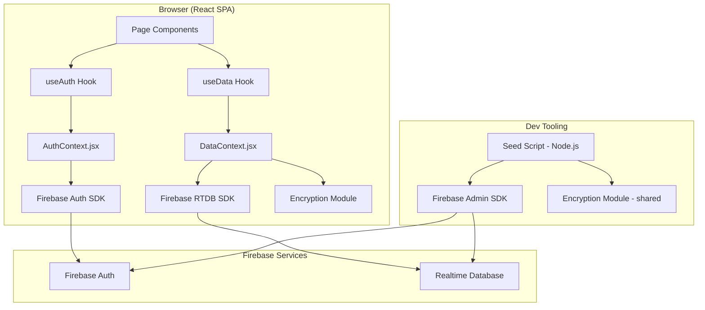

# Design Document: Firebase Integration

## Overview

This design describes the migration of the Zeb DeepCortex learning platform from an in-memory mock store to Firebase services. The migration replaces three concerns:

1. **Authentication** — mock `authenticate()` → Firebase Auth (email/password)
2. **Data persistence** — in-memory arrays in `mockStore.js` → Firebase Realtime Database
3. **Data seeding** — client-side `seedData.js` → standalone Node.js script using Firebase Admin SDK

Additionally, the migration introduces:
- Client-side AES encryption of sensitive data fields (assessment answers, exercise submissions, scores) using `crypto-js`
- Firebase Realtime Database security rules for role-based access control
- Environment-variable-driven configuration for Firebase credentials and the encryption key

The existing `useAuth()` and `useData()` hook interfaces are preserved so that page components require no changes. Course content continues to load from bundled markdown files.

## Architecture

The architecture shifts from a single-process in-memory model to a client-Firebase model:



### Key Architectural Decisions

1. **Firebase Realtime Database over Firestore**: The requirements specify RTDB. The data is relatively flat (users, assignments, progress records) and the real-time listener model maps well to the existing `useData()` pattern.

2. **No backend server**: All reads/writes go through the Firebase client SDK. Security is enforced via Firebase security rules. This keeps the deployment simple (static hosting + Firebase services).

3. **Shared encryption module**: The `crypto-js` encryption module is used both in the browser (via `src/utils/encryption.js`) and in the seed script (via Node.js `require`/`import`). The encryption key is a shared application-level secret stored in `VITE_ENCRYPTION_KEY` (client) and `ENCRYPTION_KEY` (seed script).

4. **Firebase Auth UID as database key**: User records in RTDB are keyed by the Firebase Auth UID (`users/{uid}`), which naturally aligns security rules with auth state.

5. **Preserving hook interfaces**: `useAuth()` continues to return `{ user, isAuthenticated, login, logout }`. `useData()` continues to return the same set of data operation functions. This means zero changes to page components.

## Components and Interfaces

### 1. Firebase Configuration Module (`src/firebase.js`)

Initializes the Firebase SDK and exports shared instances.

```javascript
// src/firebase.js
import { initializeApp } from 'firebase/app';
import { getAuth } from 'firebase/auth';
import { getDatabase } from 'firebase/database';

const requiredKeys = [
  'VITE_FIREBASE_API_KEY',
  'VITE_FIREBASE_AUTH_DOMAIN',
  'VITE_FIREBASE_DATABASE_URL',
  'VITE_FIREBASE_PROJECT_ID',
];

// Validate required config at init time
for (const key of requiredKeys) {
  if (!import.meta.env[key]) {
    throw new Error(`Missing required Firebase config: ${key}`);
  }
}

const firebaseConfig = {
  apiKey: import.meta.env.VITE_FIREBASE_API_KEY,
  authDomain: import.meta.env.VITE_FIREBASE_AUTH_DOMAIN,
  databaseURL: import.meta.env.VITE_FIREBASE_DATABASE_URL,
  projectId: import.meta.env.VITE_FIREBASE_PROJECT_ID,
  storageBucket: import.meta.env.VITE_FIREBASE_STORAGE_BUCKET,
  messagingSenderId: import.meta.env.VITE_FIREBASE_MESSAGING_SENDER_ID,
  appId: import.meta.env.VITE_FIREBASE_APP_ID,
};

export const app = initializeApp(firebaseConfig);
export const auth = getAuth(app);
export const database = getDatabase(app);
```

### 2. Encryption Module (`src/utils/encryption.js`)

Provides `encryptField(plaintext)` and `decryptField(ciphertext)` using AES from `crypto-js`.

```javascript
// src/utils/encryption.js
import CryptoJS from 'crypto-js';

const ENCRYPTION_KEY = import.meta.env.VITE_ENCRYPTION_KEY;

export function encryptField(value) {
  if (value === null || value === undefined) return value;
  const plaintext = typeof value === 'string' ? value : JSON.stringify(value);
  return CryptoJS.AES.encrypt(plaintext, ENCRYPTION_KEY).toString();
}

export function decryptField(ciphertext) {
  if (ciphertext === null || ciphertext === undefined) return ciphertext;
  try {
    const bytes = CryptoJS.AES.decrypt(ciphertext, ENCRYPTION_KEY);
    const decrypted = bytes.toString(CryptoJS.enc.Utf8);
    if (!decrypted) throw new Error('Decryption produced empty result');
    try { return JSON.parse(decrypted); } catch { return decrypted; }
  } catch (error) {
    throw new Error(`Decryption failed: ${error.message}`);
  }
}
```

Sensitive fields that get encrypted before write and decrypted after read:
- `assessmentResults[chapterId].answers` (object)
- `assessmentResults[chapterId].score` (number)
- `exerciseSubmissions[exerciseId].text` (string)

### 3. AuthContext (`src/contexts/AuthContext.jsx`)

Refactored to use Firebase Auth. Preserves the `useAuth()` interface.

Interface (unchanged):
```javascript
useAuth() → {
  user: { uid, name, email, role } | null,
  isAuthenticated: boolean,
  loading: boolean,       // NEW: true while resolving initial auth state
  login(email, password) → { success: boolean, error?: string },
  logout() → void,
}
```

Key behaviors:
- Subscribes to `onAuthStateChanged` on mount
- On auth state confirmed, fetches user profile from `users/{uid}` in RTDB
- Exposes `loading` state (true until initial `onAuthStateChanged` fires) so the app can show a loading indicator instead of flashing the login page
- `login()` calls `signInWithEmailAndPassword`, then fetches profile
- `logout()` calls Firebase `signOut`
- Maps Firebase error codes to user-friendly messages

### 4. DataContext (`src/contexts/DataContext.jsx`)

Refactored to use Firebase Realtime Database. Preserves the `useData()` interface.

Interface (unchanged):
```javascript
useData() → {
  loading: boolean,
  // Users
  getUsers, getUserById, createUserRecord, updateUser, deleteUser,
  // Courses
  getCourses, getCourseById, createCourseRecord, updateCourse, deleteCourse,
  addChaptersToCourse, reorderChapters,
  // Assignments
  getAssignments, createAssignmentRecord, deleteAssignment,
  // Progress
  getProgress, markChapterComplete, submitAssessment, submitExercise,
  // Timeline
  setTimeline, updateTimeline,
}
```

Key behaviors:
- Initializes RTDB listeners only after `useAuth()` confirms authentication (Requirement 9)
- On logout, detaches all listeners and clears cached state
- If a read is rejected with `PERMISSION_DENIED`, logs the user out and redirects to login
- Encrypts sensitive fields before writing, decrypts after reading
- Course content (chapters, assessments, exercises) still loaded from bundled markdown — only user data, assignments, and progress go to RTDB

### 5. Security Rules (`database.rules.json`)

```json
{
  "rules": {
    "users": {
      "$uid": {
        ".read": "auth != null && (auth.uid === $uid || root.child('users').child(auth.uid).child('role').val() === 'leadership')",
        ".write": "auth != null && auth.uid === $uid"
      }
    },
    "assignments": {
      "$assignmentId": {
        ".read": "auth != null && (data.child('learnerId').val() === auth.uid || root.child('users').child(auth.uid).child('role').val() === 'leadership')",
        ".write": "auth != null && root.child('users').child(auth.uid).child('role').val() === 'leadership'"
      }
    },
    "progress": {
      "$learnerId": {
        ".read": "auth != null && (auth.uid === $learnerId || root.child('users').child(auth.uid).child('role').val() === 'leadership')",
        ".write": "auth != null && auth.uid === $learnerId"
      }
    }
  }
}
```

### 6. Seed Script (`scripts/seed.mjs`)

A standalone Node.js script using Firebase Admin SDK that:
- Creates 3 leadership + 10 learner accounts in Firebase Auth with @zeb.co emails
- Writes user profiles to `users/{uid}` in RTDB
- Creates assignment records matching existing distribution (3 completed, 3 in-progress, 4 not-started)
- Creates progress records with encrypted sensitive fields
- Uses the same encryption module (imported for Node.js context)

### 7. Environment Variables

| Variable | Context | Purpose |
|---|---|---|
| `VITE_FIREBASE_API_KEY` | Client | Firebase API key |
| `VITE_FIREBASE_AUTH_DOMAIN` | Client | Firebase auth domain |
| `VITE_FIREBASE_DATABASE_URL` | Client | RTDB URL |
| `VITE_FIREBASE_PROJECT_ID` | Client | Firebase project ID |
| `VITE_FIREBASE_STORAGE_BUCKET` | Client | Storage bucket (optional) |
| `VITE_FIREBASE_MESSAGING_SENDER_ID` | Client | Messaging sender ID (optional) |
| `VITE_FIREBASE_APP_ID` | Client | Firebase app ID (optional) |
| `VITE_ENCRYPTION_KEY` | Client | AES encryption key |
| `GOOGLE_APPLICATION_CREDENTIALS` | Seed script | Path to Firebase Admin service account JSON |
| `ENCRYPTION_KEY` | Seed script | AES encryption key (same value as VITE_ENCRYPTION_KEY) |


## Data Models

### Realtime Database Schema

The RTDB stores data as a flat JSON tree. Paths are designed for efficient security rule evaluation and direct key lookups.

```
root/
├── users/
│   └── {uid}/
│       ├── name: string
│       ├── email: string
│       └── role: "leadership" | "learner"
├── assignments/
│   └── {assignmentId}/
│       ├── learnerId: string (uid)
│       ├── courseId: string
│       ├── status: "not_started" | "in_progress" | "completed"
│       ├── targetCompletionDate: string | null
│       └── assignedAt: string (ISO 8601)
└── progress/
    └── {learnerId}/
        └── {courseId}/
            ├── completedChapterIds: string[]
            ├── assessmentResults/
            │   └── {chapterId}/
            │       ├── answers: string (encrypted)
            │       ├── score: string (encrypted)
            │       ├── total: number
            │       └── submittedAt: string (ISO 8601)
            └── exerciseSubmissions/
                └── {exerciseId}/
                    ├── text: string (encrypted)
                    └── submittedAt: string (ISO 8601)
```

### Encrypted vs. Plaintext Fields

| Path | Field | Encrypted? |
|---|---|---|
| `assessmentResults/{chapterId}/answers` | Assessment answer selections | Yes |
| `assessmentResults/{chapterId}/score` | Numeric score | Yes |
| `assessmentResults/{chapterId}/total` | Total questions | No |
| `assessmentResults/{chapterId}/submittedAt` | Timestamp | No |
| `exerciseSubmissions/{exerciseId}/text` | Submission text | Yes |
| `exerciseSubmissions/{exerciseId}/submittedAt` | Timestamp | No |

### Course Data (unchanged — stays in bundled markdown)

Course content, chapters, assessments, and exercises continue to be loaded from markdown files in the `Courses/` directory and parsed at runtime. They are not stored in RTDB. The `courseId` and `chapterId` values used in RTDB records reference the IDs generated at parse time by the model factory functions.

### Entity Mapping from Mock Store

| Mock Store Entity | RTDB Path | Key Change |
|---|---|---|
| `users[]` | `users/{uid}` | Keyed by Firebase Auth UID instead of generated ID; password removed (handled by Firebase Auth) |
| `assignments[]` | `assignments/{assignmentId}` | `learnerId` now stores Firebase Auth UID |
| `progressRecords[]` | `progress/{learnerId}/{courseId}` | Composite key path; sensitive fields encrypted |
| `courses[]` | N/A — bundled markdown | No change |


## Correctness Properties

*A property is a characteristic or behavior that should hold true across all valid executions of a system — essentially, a formal statement about what the system should do. Properties serve as the bridge between human-readable specifications and machine-verifiable correctness guarantees.*

### Property 1: Missing Firebase config throws descriptive error

*For any* required Firebase configuration key that is absent from the environment, initializing the Firebase config module should throw an error whose message contains the name of the missing key.

**Validates: Requirements 1.4**

### Property 2: Auth error codes map to user-friendly messages

*For any* Firebase Auth error code (e.g., `auth/user-not-found`, `auth/wrong-password`, `auth/invalid-email`), the error mapping function should return a non-empty string that does not contain the raw Firebase error code prefix `auth/`.

**Validates: Requirements 2.5**

### Property 3: Encryption round-trip preserves data

*For any* string value, encrypting it with `encryptField` and then decrypting the result with `decryptField` should produce a value equal to the original string. Additionally, the encrypted ciphertext must not equal the original plaintext.

**Validates: Requirements 5.1, 5.2**

### Property 4: Corrupted ciphertext produces a descriptive error

*For any* random string that is not a valid AES ciphertext, calling `decryptField` on it should throw an error with a non-empty message, and should never return a value silently.

**Validates: Requirements 5.5**

### Property 5: User profile data round-trip

*For any* valid user profile object (with name, email, role), writing it to the RTDB path `users/{uid}` and reading it back should produce an object equal to the original profile.

**Validates: Requirements 4.1**

### Property 6: Assignment data round-trip

*For any* valid assignment object (with learnerId, courseId, status, targetCompletionDate, assignedAt), writing it to the RTDB path `assignments/{id}` and reading it back should produce an object equal to the original assignment.

**Validates: Requirements 4.2, 4.4**

### Property 7: Progress data round-trip with encryption

*For any* valid progress record (with completedChapterIds, assessmentResults, exerciseSubmissions), writing it through the DataContext (which encrypts sensitive fields) and reading it back (which decrypts) should produce a record equal to the original. The raw RTDB value for encrypted fields must differ from the plaintext values.

**Validates: Requirements 4.3, 5.1, 5.2**

### Property 8: Learner data isolation

*For any* two distinct learner users A and B, learner A should be able to read and write their own data at `users/{uidA}` and `progress/{uidA}`, but should be denied read and write access to `users/{uidB}` and `progress/{uidB}`.

**Validates: Requirements 6.1**

### Property 9: Leadership read access

*For any* leadership user and *for any* data path (users, assignments, progress), the leadership user should be granted read access. Additionally, for any assignment path, the leadership user should be granted write access.

**Validates: Requirements 6.2, 6.3**

### Property 10: Unauthenticated access denied

*For any* data path in the database (users, assignments, progress), an unauthenticated request should be denied both read and write access.

**Validates: Requirements 6.4**

## Error Handling

### Authentication Errors

| Firebase Error Code | User-Facing Message |
|---|---|
| `auth/user-not-found` | "No account found with this email address" |
| `auth/wrong-password` | "Incorrect password" |
| `auth/invalid-email` | "Please enter a valid email address" |
| `auth/user-disabled` | "This account has been disabled" |
| `auth/too-many-requests` | "Too many login attempts. Please try again later" |
| `auth/invalid-credential` | "Invalid email or password" |
| Default | "Login failed. Please try again" |

### Database Errors

- **PERMISSION_DENIED**: Log the user out, clear cached data, redirect to login page. This handles token expiry and role changes.
- **NETWORK_ERROR / UNAVAILABLE**: Return a descriptive error to the calling component. Firebase RTDB has built-in offline persistence that will retry automatically.
- **Write failures**: Return the error message to the calling component so it can display feedback to the user.

### Encryption Errors

- **Decryption failure** (corrupted/tampered data): Throw a descriptive `Error` with message `"Decryption failed: ..."`. The calling code in DataContext catches this and returns an error to the component rather than serving malformed data.
- **Missing encryption key**: The encryption module should throw at import time if `VITE_ENCRYPTION_KEY` is not set.

### Seed Script Errors

- **Duplicate user creation**: The seed script should check if users already exist before creating them, or use `createUser` with error handling to skip existing accounts.
- **Admin SDK auth failure**: Fail fast with a clear message about missing `GOOGLE_APPLICATION_CREDENTIALS`.

## Testing Strategy

### Testing Framework

- **Unit/Integration tests**: Vitest (already configured in the project)
- **Property-based tests**: fast-check (already a dev dependency)
- **Minimum iterations**: 100 per property test

### Unit Tests

Unit tests cover specific examples, edge cases, and integration points:

1. **Firebase config module**: Verify it throws when a required env var is missing (specific key examples)
2. **Auth error mapping**: Verify specific error codes produce expected messages
3. **Encryption module**: Test with known plaintext/ciphertext pairs; test empty string edge case; test null/undefined passthrough
4. **AuthContext**: Test login success flow, login failure flow, logout clears state, loading state during init
5. **DataContext**: Test that listeners are not created before auth; test that logout clears listeners; test PERMISSION_DENIED triggers logout
6. **Security rules**: Use Firebase emulator to test specific access scenarios (learner reads own data, learner denied other's data, leadership reads all, unauthenticated denied)
7. **Seed script**: Verify correct user count, email domain, assignment distribution
8. **Mock store removal**: Verify no imports of mockStore.js or seedData.js remain in source

### Property-Based Tests

Each property test uses fast-check with a minimum of 100 iterations and references its design property.

| Property | Test Description | Generator Strategy |
|---|---|---|
| Property 1 | Generate random subsets of required config keys, verify missing ones produce named errors | `fc.subarray` of required key names |
| Property 2 | Generate Firebase auth error codes, verify mapped messages are non-empty and don't contain raw codes | `fc.constantFrom` known error codes |
| Property 3 | Generate random strings, verify encrypt→decrypt round-trip and ciphertext ≠ plaintext | `fc.string()` |
| Property 4 | Generate random non-ciphertext strings, verify decryptField throws | `fc.string()` filtered to exclude valid ciphertext patterns |
| Property 5 | Generate random user profiles, verify write→read round-trip | `fc.record({ name: fc.string(), email: fc.string(), role: fc.constantFrom('leadership', 'learner') })` |
| Property 6 | Generate random assignment objects, verify write→read round-trip | `fc.record` with assignment fields |
| Property 7 | Generate random progress records with sensitive fields, verify encrypted write→decrypted read round-trip | `fc.record` with nested assessment results and exercise submissions |
| Property 8 | Generate pairs of learner UIDs, verify cross-access is denied | `fc.tuple(fc.uuid(), fc.uuid())` |
| Property 9 | Generate leadership UID and random data paths, verify read access granted | `fc.uuid()` + `fc.constantFrom` paths |
| Property 10 | Generate random data paths, verify unauthenticated access denied | `fc.constantFrom` paths |

### Test Tagging Convention

Each property-based test must include a comment referencing the design property:

```javascript
// Feature: firebase-integration, Property 3: Encryption round-trip preserves data
test.prop([fc.string({ minLength: 1 })], { numRuns: 100 })('encrypt then decrypt returns original', ([input]) => {
  const encrypted = encryptField(input);
  expect(encrypted).not.toBe(input);
  expect(decryptField(encrypted)).toBe(input);
});
```

### Security Rules Testing

Security rules (Properties 8, 9, 10) require the Firebase Emulator Suite. Tests should:
1. Start the RTDB emulator before the test suite
2. Seed test data with known UIDs and roles
3. Use the Firebase client SDK with emulator connection to test access patterns
4. Tear down after the suite

If the emulator is not available in CI, these tests can be marked as integration tests and run separately.
