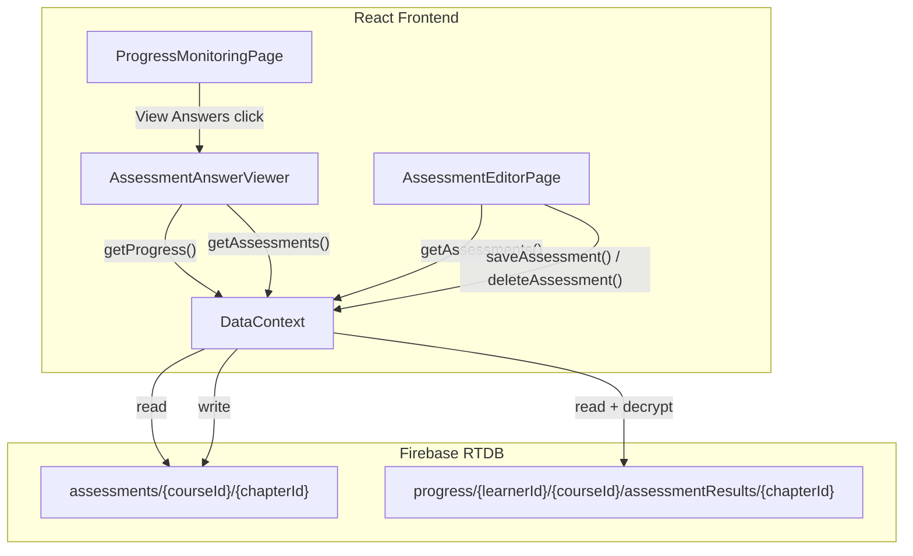
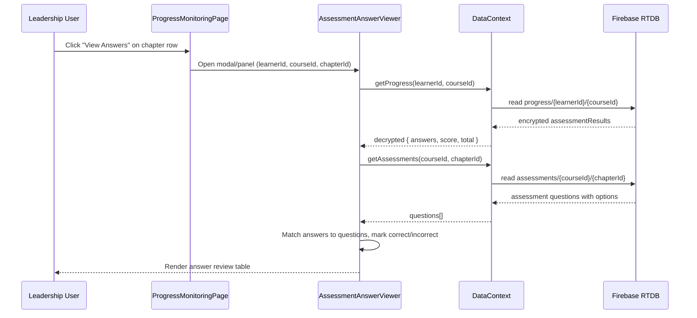
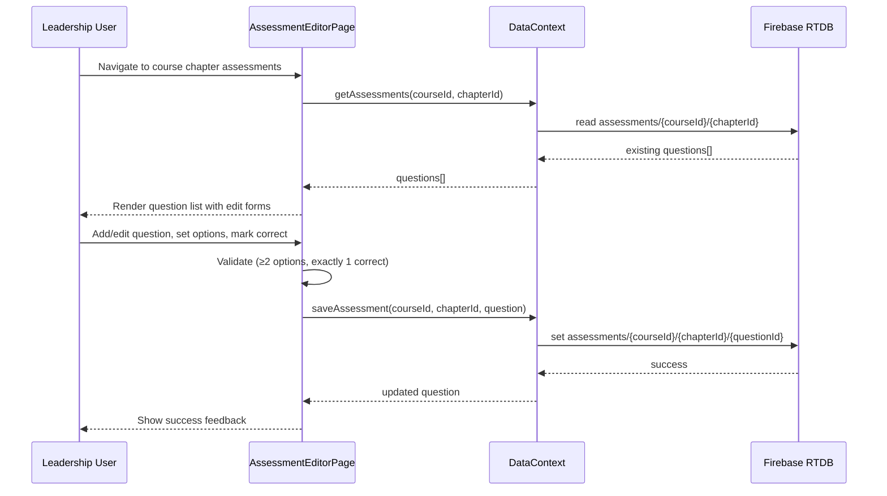

# Design Document: Leadership Assessment Management

## Overview

This feature adds two capabilities to the Zeb DeepCortex learning platform for leadership users:

1. **Assessment Answer Viewer** — Leadership can drill into any learner's assessment results to see the exact questions, the learner's selected answers, the correct answers, and per-question correctness. The encrypted progress data in Firebase RTDB is already decrypted by `DataContext.getProgress()`; this feature surfaces that data in a new detail view accessible from the Progress Monitoring page.

2. **Assessment Question Editor** — Leadership can add, edit, and delete assessment questions (with multiple-choice options and correct-answer marking) for any course chapter. This requires migrating assessment definitions from the hardcoded `courseData.js` to Firebase RTDB under a new `assessments/{courseId}/{chapterId}` path, so that leadership can modify them at runtime without code changes.

The existing encryption/decryption pipeline, RTDB security rules, and DataContext patterns are preserved and extended.

## Architecture



## Sequence Diagrams

### Viewing Learner Assessment Answers



### Adding/Editing Assessment Questions



## Components and Interfaces

### Component 1: AssessmentAnswerViewer

**Purpose**: Displays a learner's assessment answers for a specific chapter, showing each question, the learner's answer, the correct answer, and whether they got it right.

**Interface**:
```jsx
// Props
{
  learnerId: string,
  courseId: string,
  chapterId: string,
  onClose: () => void
}
```

**Responsibilities**:
- Fetch decrypted progress data via `getProgress()`
- Fetch assessment question definitions via `getAssessments()`
- Cross-reference learner answers with correct answers
- Render a per-question review table with visual correct/incorrect indicators

### Component 2: AssessmentEditorPage

**Purpose**: Allows leadership to manage assessment questions for a course chapter — list, add, edit, and delete questions with multiple-choice options.

**Interface**:
```jsx
// Route: /leadership/courses/:courseId/chapters/:chapterId/assessments
// Uses useParams() to get courseId and chapterId
```

**Responsibilities**:
- Load existing assessment questions from RTDB
- Provide form UI for adding new questions
- Provide inline editing for existing questions
- Validate question structure (≥2 options, exactly 1 correct)
- Persist changes to RTDB via DataContext

### Component 3: QuestionForm

**Purpose**: Reusable form component for creating or editing a single assessment question with its options.

**Interface**:
```jsx
{
  question: Assessment | null,   // null = new question mode
  onSave: (questionData) => void,
  onCancel: () => void
}
```

**Responsibilities**:
- Render question text input
- Render dynamic option list (add/remove options)
- Radio button to mark exactly one correct answer
- Client-side validation before calling onSave

## Data Models

### Assessment Question (RTDB: `assessments/{courseId}/{chapterId}/{questionId}`)

```javascript
// Stored in RTDB
{
  id: "assessment-ch1-q1",        // deterministic or generated ID
  question: "Which approach to machine translation became dominant around 2016?",
  options: {
    "opt-1": { text: "Rule-Based Machine Translation", isCorrect: false },
    "opt-2": { text: "Statistical Machine Translation", isCorrect: false },
    "opt-3": { text: "Neural Machine Translation", isCorrect: true },
    "opt-4": { text: "Dictionary-Based Translation", isCorrect: false }
  },
  createdAt: "2026-01-01T00:00:00.000Z",
  updatedAt: "2026-01-15T10:30:00.000Z"
}
```

**Validation Rules**:
- `question` must be a non-empty string
- `options` must have at least 2 entries
- Exactly one option must have `isCorrect: true`
- Each option `text` must be non-empty

### Decrypted Assessment Result (already exists in progress)

```javascript
// From getProgress() — already decrypted by DataContext
{
  answers: {
    "assessment-ch1-q1": "opt-3",   // questionId → selected optionId
    "assessment-ch1-q2": "opt-1",
    "assessment-ch1-q3": "opt-2"
  },
  score: 2,
  total: 3,
  submittedAt: "2026-02-10T14:22:00.000Z"
}
```

### Answer Review (computed client-side)

```javascript
// Built by AssessmentAnswerViewer for display
{
  questionId: "assessment-ch1-q1",
  questionText: "Which approach to machine translation became dominant around 2016?",
  selectedOptionId: "opt-3",
  selectedOptionText: "Neural Machine Translation",
  correctOptionId: "opt-3",
  correctOptionText: "Neural Machine Translation",
  isCorrect: true
}
```

## Key Functions with Formal Specifications

### Function 1: getAssessments(courseId, chapterId)

```javascript
async function getAssessments(courseId, chapterId) → Assessment[]
```

**Preconditions:**
- `courseId` is a non-empty string matching an existing course
- `chapterId` is a non-empty string matching a chapter in that course
- User is authenticated

**Postconditions:**
- Returns an array of Assessment objects from RTDB `assessments/{courseId}/{chapterId}`
- If no assessments exist at that path, returns `[]`
- Each returned assessment has `id`, `question`, and `options` with at least 2 entries
- Does not modify any data

### Function 2: saveAssessment(courseId, chapterId, assessmentData)

```javascript
async function saveAssessment(courseId, chapterId, assessmentData) → Assessment
```

**Preconditions:**
- `courseId` and `chapterId` are non-empty strings
- `assessmentData.question` is a non-empty string
- `assessmentData.options` has ≥ 2 entries
- Exactly one option in `assessmentData.options` has `isCorrect === true`
- User has leadership role

**Postconditions:**
- If `assessmentData.id` exists, updates the existing record at `assessments/{courseId}/{chapterId}/{id}`
- If `assessmentData.id` is absent, creates a new record with a generated ID
- Returns the saved Assessment object with all fields populated
- `updatedAt` timestamp is set to current time

### Function 3: deleteAssessment(courseId, chapterId, assessmentId)

```javascript
async function deleteAssessment(courseId, chapterId, assessmentId) → void
```

**Preconditions:**
- All three IDs are non-empty strings
- A record exists at `assessments/{courseId}/{chapterId}/{assessmentId}`
- User has leadership role

**Postconditions:**
- The record at `assessments/{courseId}/{chapterId}/{assessmentId}` is removed from RTDB
- Does not affect learner progress data (existing submissions remain intact)

### Function 4: buildAnswerReview(assessmentQuestions, assessmentResult)

```javascript
function buildAnswerReview(assessmentQuestions, assessmentResult) → AnswerReview[]
```

**Preconditions:**
- `assessmentQuestions` is an array of Assessment objects with valid options
- `assessmentResult` has an `answers` map of `questionId → selectedOptionId`

**Postconditions:**
- Returns one `AnswerReview` entry per question in `assessmentQuestions`
- For each entry: `isCorrect === true` iff `selectedOptionId === correctOptionId`
- If a question has no matching answer in `assessmentResult.answers`, `selectedOptionId` is `null` and `isCorrect` is `false`
- The returned array length equals `assessmentQuestions.length`

**Loop Invariants:**
- For each processed question `q[i]`: `review[i].questionId === q[i].id`
- Count of `isCorrect === true` entries ≤ `assessmentResult.score`

## Algorithmic Pseudocode

### Assessment Data Migration Algorithm

```javascript
// One-time seed script to migrate hardcoded assessments to RTDB
async function migrateAssessmentsToRTDB(database) {
  const courses = getCourses()  // from courseData.js

  for (const course of courses) {
    for (const chapter of course.chapters) {
      if (chapter.assessments.length === 0) continue

      const chapterAssessments = {}
      for (const assessment of chapter.assessments) {
        // Convert options array to object keyed by option ID
        const options = {}
        for (const opt of assessment.options) {
          options[opt.id] = { text: opt.text, isCorrect: opt.isCorrect }
        }

        chapterAssessments[assessment.id] = {
          id: assessment.id,
          question: assessment.question,
          options,
          createdAt: new Date().toISOString(),
          updatedAt: new Date().toISOString()
        }
      }

      // Write to RTDB: assessments/{courseId}/{chapterId}
      await set(
        ref(database, `assessments/${course.id}/${chapter.id}`),
        chapterAssessments
      )
    }
  }
}
```

### Answer Review Builder Algorithm

```javascript
function buildAnswerReview(questions, result) {
  const reviews = []

  for (const question of questions) {
    const selectedOptionId = result.answers[question.id] || null
    const correctOption = Object.entries(question.options)
      .find(([, opt]) => opt.isCorrect)
    const correctOptionId = correctOption ? correctOption[0] : null

    reviews.push({
      questionId: question.id,
      questionText: question.question,
      selectedOptionId,
      selectedOptionText: selectedOptionId
        ? question.options[selectedOptionId]?.text ?? '(deleted option)'
        : '(no answer)',
      correctOptionId,
      correctOptionText: correctOption ? correctOption[1].text : '(unknown)',
      isCorrect: selectedOptionId !== null && selectedOptionId === correctOptionId
    })
  }

  return reviews
}
```

### Assessment Validation Algorithm

```javascript
function validateAssessment(data) {
  const errors = []

  if (!data.question || data.question.trim() === '') {
    errors.push('Question text is required')
  }

  const options = Object.values(data.options || {})
  if (options.length < 2) {
    errors.push('At least 2 options are required')
  }

  for (const [i, opt] of options.entries()) {
    if (!opt.text || opt.text.trim() === '') {
      errors.push(`Option ${i + 1} text is required`)
    }
  }

  const correctCount = options.filter(o => o.isCorrect).length
  if (correctCount !== 1) {
    errors.push('Exactly one option must be marked as correct')
  }

  return { valid: errors.length === 0, errors }
}
```

### submitAssessment Refactor (score against RTDB questions)

```javascript
// Updated submitAssessment in DataContext — scores against RTDB instead of hardcoded data
async function submitAssessment(learnerId, chapterId, answers) {
  // Step 1: Find courseId for this chapter (still from courseData for chapter→course mapping)
  const courses = getCoursesFromData()
  let courseId = null
  for (const course of courses) {
    if (course.chapters.find(ch => ch.id === chapterId)) {
      courseId = course.id
      break
    }
  }
  if (!courseId) throw { error: 'Not found' }

  // Step 2: Fetch assessment questions from RTDB
  const assessments = await getAssessments(courseId, chapterId)
  if (assessments.length === 0) throw { error: 'No assessments found' }

  // Step 3: Score answers against RTDB questions
  let score = 0
  const total = assessments.length
  for (const assessment of assessments) {
    const selectedOptionId = answers[assessment.id]
    const correctOption = Object.entries(assessment.options)
      .find(([, opt]) => opt.isCorrect)
    if (correctOption && selectedOptionId === correctOption[0]) {
      score += 1
    }
  }

  // Step 4: Encrypt and persist (unchanged pattern)
  const result = {
    answers: encryptField(answers),
    score: encryptField(score),
    total,
    submittedAt: new Date().toISOString()
  }

  await set(
    ref(database, `progress/${learnerId}/${courseId}/assessmentResults/${chapterId}`),
    result
  )

  return { answers, score, total, submittedAt: result.submittedAt }
}
```

## Example Usage

```jsx
// Example 1: Viewing learner answers from ProgressMonitoringPage
function handleViewAnswers(learnerId, courseId, chapterId) {
  setAnswerViewerProps({ learnerId, courseId, chapterId })
  setShowAnswerViewer(true)
}

// In JSX:
{showAnswerViewer && (
  <AssessmentAnswerViewer
    learnerId={answerViewerProps.learnerId}
    courseId={answerViewerProps.courseId}
    chapterId={answerViewerProps.chapterId}
    onClose={() => setShowAnswerViewer(false)}
  />
)}
```

```jsx
// Example 2: Assessment editor saving a question
async function handleSaveQuestion(questionData) {
  const validation = validateAssessment(questionData)
  if (!validation.valid) {
    setErrors(validation.errors)
    return
  }
  await saveAssessment(courseId, chapterId, questionData)
  await loadQuestions() // refresh list
}
```

```jsx
// Example 3: DataContext getAssessments usage
const { getAssessments } = useData()
const questions = await getAssessments('nmt-course-001', 'chapter-01')
// Returns: [{ id, question, options: { optId: { text, isCorrect } }, ... }]
```

## Correctness Properties

*A property is a characteristic or behavior that should hold true across all valid executions of a system — essentially, a formal statement about what the system should do. Properties serve as the bridge between human-readable specifications and machine-verifiable correctness guarantees.*

### Property 1: Answer review output length equals input questions length

*For any* array of Assessment_Questions and any Assessment_Result, `buildAnswerReview()` SHALL return an array whose length equals the input questions array length, and each entry's `questionId` SHALL correspond to the question at the same index.

**Validates: Requirements 5.1**

### Property 2: Answer review correctness is a biconditional on option match

*For any* Assessment_Question and any learner answer, the resulting Answer_Review entry SHALL have `isCorrect === true` if and only if the learner's `selectedOptionId` equals the question's correct `optionId`.

**Validates: Requirements 5.2, 5.3**

### Property 3: Validation biconditional — valid iff all rules pass

*For any* Assessment_Question data object, `validateAssessment()` SHALL return `valid: true` if and only if: the `question` field is a non-empty non-whitespace string, there are at least 2 options, every option has a non-empty non-whitespace `text`, and exactly one option has `isCorrect: true`.

**Validates: Requirements 4.1, 4.2, 4.3, 4.4, 4.5**

### Property 4: Idempotent save — saving twice produces same state

*For any* valid Assessment_Question with an `id`, calling `saveAssessment()` twice with the same data SHALL produce the same RTDB state — no duplicate records are created, and the retrieved question matches the saved data.

**Validates: Requirements 2.2, 2.3**

### Property 5: Migration fidelity — hardcoded data preserved in RTDB

*For any* chapter with hardcoded assessments in `courseData.js`, after migration the RTDB record SHALL contain the same question text, option texts, and correct-answer markings, with options converted from array format to object format keyed by option ID.

**Validates: Requirements 9.2, 9.4**

### Property 6: Delete safety — progress data unchanged after question deletion

*For any* Assessment_Question deletion, all existing learner Assessment_Results SHALL remain unchanged in RTDB.

**Validates: Requirements 3.1, 3.2**

### Property 7: Scoring correctness — score equals count of correct matches

*For any* set of Assessment_Questions and any learner answers map, the computed score SHALL equal the number of answers where the selected option ID matches the correct option ID for that question.

**Validates: Requirement 10.2**

### Property 8: Assessment data retrieval preserves all fields

*For any* valid RTDB snapshot of Assessment_Questions, `getAssessments()` SHALL return objects with `id`, `question`, `options`, `createdAt`, and `updatedAt` fields matching the stored values.

**Validates: Requirements 1.1, 1.3**

## Error Handling

### Error Scenario 1: No Assessment Data in RTDB

**Condition**: `getAssessments()` returns empty array for a chapter (assessments not yet migrated or all deleted)
**Response**: AssessmentAnswerViewer shows "No assessment questions found for this chapter" message. AssessmentEditorPage shows empty state with "Add Question" prompt.
**Recovery**: Leadership can add questions via the editor. Existing progress data remains intact.

### Error Scenario 2: Learner Answer References Deleted Question

**Condition**: A learner's stored answer references a `questionId` or `optionId` that no longer exists in RTDB
**Response**: `buildAnswerReview()` shows "(deleted option)" for the selected answer text and marks `isCorrect: false`
**Recovery**: No action needed — historical data is preserved, display degrades gracefully.

### Error Scenario 3: Validation Failure on Save

**Condition**: Leadership submits a question with < 2 options or no correct answer marked
**Response**: `validateAssessment()` returns error messages, form displays inline errors, save is blocked
**Recovery**: User corrects the form and resubmits.

### Error Scenario 4: RTDB Permission Denied

**Condition**: Non-leadership user attempts to write to `assessments/` path
**Response**: Firebase RTDB rules reject the write. `handlePermissionDenied()` in DataContext triggers logout.
**Recovery**: User must log in with a leadership account.

### Error Scenario 5: Concurrent Edit Conflict

**Condition**: Two leadership users edit the same question simultaneously
**Response**: Last write wins (Firebase RTDB default behavior). No data corruption since each question is an atomic node.
**Recovery**: The second user's changes overwrite the first. A future enhancement could add optimistic locking via `updatedAt` comparison.

## Testing Strategy

### Unit Testing Approach

- `buildAnswerReview()`: Test with matching answers, missing answers, deleted options, empty questions array
- `validateAssessment()`: Test all validation rules — empty question, too few options, no correct answer, multiple correct answers, valid input
- Assessment RTDB data transformation: Test conversion between array format (courseData.js) and object format (RTDB)

### Integration Testing Approach

- `getAssessments()` → verify RTDB read returns correctly structured data
- `saveAssessment()` → verify RTDB write and subsequent read consistency
- `deleteAssessment()` → verify removal and that progress data is unaffected
- `submitAssessment()` (refactored) → verify scoring against RTDB questions produces correct results
- Migration script → verify all 13 chapters' assessments are correctly written to RTDB

### Component Testing Approach

- AssessmentAnswerViewer: Renders correct/incorrect indicators, handles missing data gracefully
- QuestionForm: Validates inputs, prevents save with invalid data, handles add and edit modes
- AssessmentEditorPage: Lists questions, supports add/edit/delete flows

## Security Considerations

### Firebase RTDB Rules Update

New rules needed for the `assessments` path:

```json
{
  "assessments": {
    ".read": "auth != null",
    "$courseId": {
      "$chapterId": {
        ".write": "auth != null && root.child('users').child(auth.uid).child('role').val() === 'leadership'"
      }
    }
  }
}
```

- **Read**: All authenticated users can read assessments (learners need them to take assessments)
- **Write**: Only leadership users can create/edit/delete assessment questions
- Assessment questions are not encrypted (they are course content, not PII)
- Learner answers remain encrypted in the `progress/` path (unchanged)

### Client-Side Considerations

- The `isCorrect` field is visible to learners in RTDB reads. This is acceptable because the current system already exposes correct answers in the bundled JavaScript. A future enhancement could move scoring to a Cloud Function.
- No new PII is introduced by this feature.

## Dependencies

- **Firebase Realtime Database**: New `assessments/` path for question storage
- **crypto-js**: Existing dependency, unchanged — used for progress encryption/decryption
- **react-router-dom**: Existing dependency — new route for assessment editor
- **Migration script**: One-time script to seed RTDB with existing hardcoded assessments from `courseData.js`
