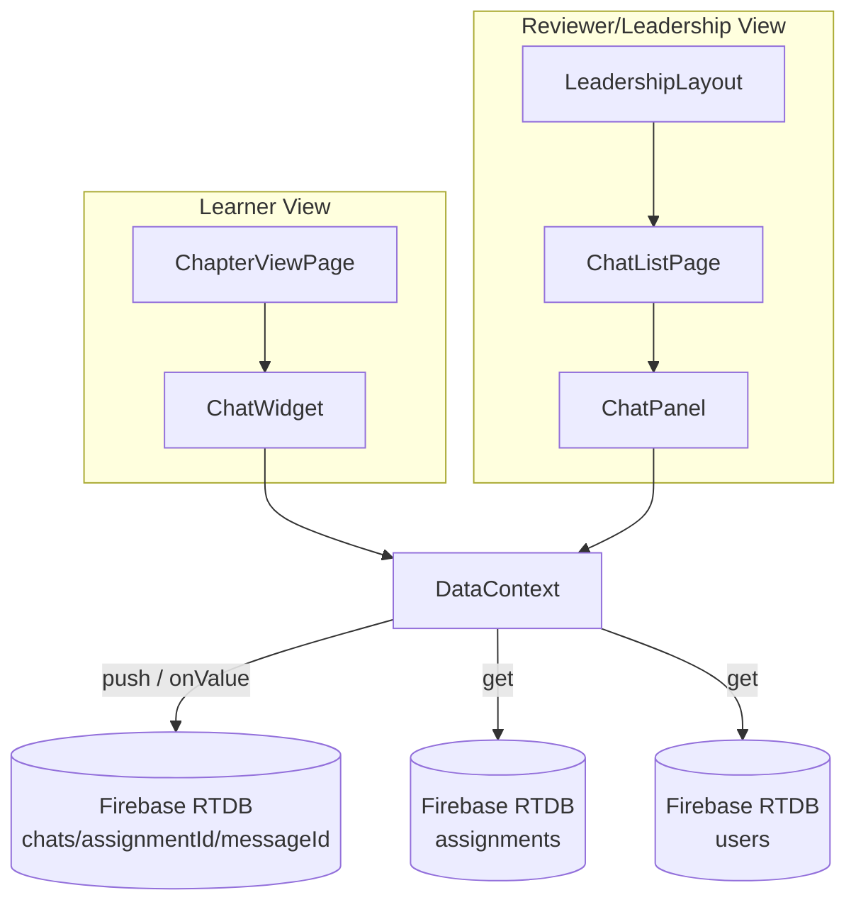
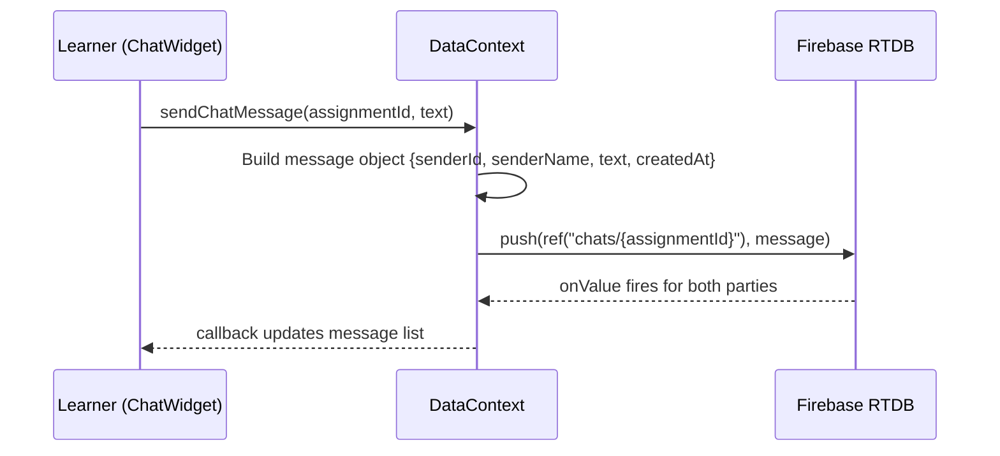
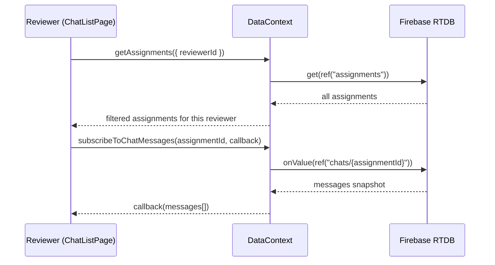
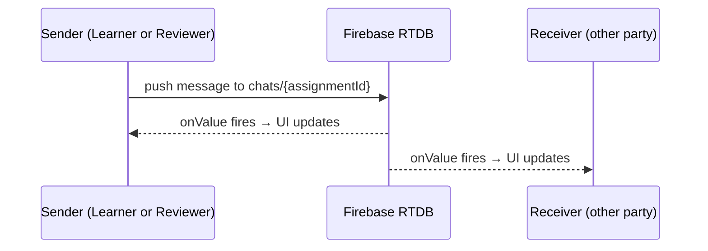

# Design Document: Reviewer Chat

## Overview

The Reviewer Chat feature replaces the existing static `ReviewerContactCard` with a real-time chat widget on the learner's `ChapterViewPage`. Learners can send messages to their assigned reviewer directly from the course content view. Reviewers and leadership users access a dedicated chat page from the sidebar to view and respond to all their active learner conversations.

Messages are stored in Firebase Realtime Database at `chats/{assignmentId}/{messageId}` and delivered in real-time using `onValue` listeners. Each chat thread is scoped to a learner-course-reviewer assignment, ensuring conversations stay contextual and secure.

The feature integrates with the existing `DataContext` pattern for all data operations and follows the established component/layout conventions already in the codebase.

## Architecture



## Sequence Diagrams

### Learner Sends a Message



### Reviewer Opens Conversation List



### Real-Time Message Delivery



## Components and Interfaces

### Component 1: ChatWidget (replaces ReviewerContactCard)

**Purpose**: Floating chat widget on ChapterViewPage. Shows a toggle button; when expanded, displays the message thread and an input field.

**Props**:
```javascript
// ChatWidget.jsx
{
  assignmentId: string,   // The assignment linking learner ↔ reviewer
  reviewer: { uid, name, email },  // Reviewer profile
  learnerName: string     // Current learner's display name
}
```

**Responsibilities**:
- Toggle between collapsed (button) and expanded (chat panel) states
- Subscribe to real-time messages via `subscribeToChatMessages`
- Send messages via `sendChatMessage`
- Auto-scroll to latest message
- Show reviewer name in header

### Component 2: ChatPanel

**Purpose**: Reusable message thread + input component. Used by both ChatWidget and ChatListPage.

**Props**:
```javascript
// ChatPanel.jsx
{
  messages: Array<{ id, senderId, senderName, text, createdAt }>,
  currentUserId: string,
  onSend: (text: string) => void,
  headerLabel: string     // e.g. "Chat with Alice" or "Chat with Reviewer"
}
```

**Responsibilities**:
- Render message list with sender alignment (own messages right, others left)
- Text input with send button
- Auto-scroll to bottom on new messages
- Display timestamps
- Empty state when no messages

### Component 3: ChatListPage

**Purpose**: Page for reviewers/leadership to see all their active chat conversations and respond.

**Responsibilities**:
- Fetch assignments where current user is the reviewer
- Display list of learner conversations with last message preview
- Select a conversation to open ChatPanel
- Real-time updates for incoming messages across all conversations
- Show learner name and course name per conversation

## Data Models

### Message

```javascript
// Stored at chats/{assignmentId}/{messageId}
{
  senderId: string,    // Firebase Auth UID
  senderName: string,  // Display name at time of send
  text: string,        // Message content
  createdAt: string    // ISO 8601 timestamp
}
```

**Validation Rules**:
- `senderId` must be a non-empty string matching an authenticated user
- `senderName` must be a non-empty string
- `text` must be a non-empty string (trimmed), max 2000 characters
- `createdAt` must be a valid ISO 8601 string

### Assignment (existing, relevant fields)

```javascript
// Stored at assignments/{assignmentId}
{
  learnerId: string,
  courseId: string,
  reviewerId: string,   // Links to the reviewer
  status: string,
  // ... other fields
}
```

### Firebase RTDB Structure

```
chats/
  {assignmentId}/
    {auto-generated-push-id}/
      senderId: "uid123"
      senderName: "Alice"
      text: "I have a question about chapter 3"
      createdAt: "2025-01-15T10:30:00.000Z"
```

## Key Functions with Formal Specifications

### Function 1: sendChatMessage()

```javascript
async function sendChatMessage(assignmentId, text)
```

**Preconditions:**
- `assignmentId` is a non-empty string referencing an existing assignment
- `text` is a non-empty string after trimming, length ≤ 2000
- `user` is authenticated (available from AuthContext)
- The authenticated user is either the learner or reviewer on this assignment

**Postconditions:**
- A new message node is created at `chats/{assignmentId}/{newId}`
- The message contains `senderId`, `senderName`, `text`, `createdAt`
- `createdAt` is set to the current ISO timestamp
- All active `onValue` listeners on this path receive the new message

**Loop Invariants:** N/A

### Function 2: subscribeToChatMessages()

```javascript
function subscribeToChatMessages(assignmentId, callback)
// Returns: unsubscribe function
```

**Preconditions:**
- `assignmentId` is a non-empty string
- `callback` is a function accepting an array of message objects

**Postconditions:**
- An `onValue` listener is attached to `chats/{assignmentId}`
- `callback` is invoked immediately with current messages (or empty array)
- `callback` is invoked on every subsequent change
- Returned function, when called, detaches the listener

**Loop Invariants:** N/A

### Function 3: getReviewerConversations()

```javascript
async function getReviewerConversations(reviewerUid)
// Returns: Array<{ assignmentId, learnerId, learnerName, courseId, courseName }>
```

**Preconditions:**
- `reviewerUid` is a non-empty string matching an authenticated user with role "leadership"

**Postconditions:**
- Returns an array of conversation metadata for all assignments where `reviewerId === reviewerUid`
- Each entry includes resolved `learnerName` (from users node) and `courseName` (from course data)
- Returns empty array if no assignments found

**Loop Invariants:**
- For each processed assignment: learner profile has been resolved or skipped

## Algorithmic Pseudocode

### Send Message Algorithm

```javascript
// DataContext: sendChatMessage
async function sendChatMessage(assignmentId, text) {
  // ASSERT: user is authenticated
  const trimmed = text.trim();
  if (!trimmed || trimmed.length > 2000) {
    throw new Error('Message must be 1-2000 characters');
  }

  const message = {
    senderId: user.uid,
    senderName: user.name,
    text: trimmed,
    createdAt: new Date().toISOString()
  };

  const chatRef = ref(database, `chats/${assignmentId}`);
  const newMsgRef = push(chatRef);
  await set(newMsgRef, message);

  // ASSERT: message now exists at chats/{assignmentId}/{newMsgRef.key}
  return { id: newMsgRef.key, ...message };
}
```

### Subscribe to Messages Algorithm

```javascript
// DataContext: subscribeToChatMessages
function subscribeToChatMessages(assignmentId, callback) {
  const chatRef = ref(database, `chats/${assignmentId}`);

  const unsubscribe = onValue(chatRef, (snapshot) => {
    if (!snapshot.exists()) {
      callback([]);
      return;
    }
    const data = snapshot.val();
    const messages = Object.entries(data)
      .map(([id, msg]) => ({ id, ...msg }))
      .sort((a, b) => new Date(a.createdAt) - new Date(b.createdAt));

    // ASSERT: messages are sorted ascending by createdAt
    callback(messages);
  });

  return unsubscribe;
}
```

### Load Reviewer Conversations Algorithm

```javascript
// DataContext: getReviewerConversations
async function getReviewerConversations(reviewerUid) {
  const assignments = await getAssignments({ reviewerId: reviewerUid });
  // ASSERT: assignments filtered to only this reviewer

  const conversations = [];

  for (const assignment of assignments) {
    // INVARIANT: all previously processed assignments have resolved names
    let learnerName = 'Unknown Learner';
    try {
      const learner = await getUserById(assignment.learnerId);
      learnerName = learner.name;
    } catch {
      // learner profile unavailable, use fallback
    }

    const course = await getCourseById(assignment.courseId);
    const courseName = course?.title || 'Unknown Course';

    conversations.push({
      assignmentId: assignment.id,
      learnerId: assignment.learnerId,
      learnerName,
      courseId: assignment.courseId,
      courseName
    });
  }

  // ASSERT: conversations.length === assignments.length
  return conversations;
}
```

## Example Usage

### Learner Side: ChatWidget in ChapterViewPage

```javascript
// In ChapterViewPage.jsx — replace ReviewerContactCard usage:
<ChatWidget
  assignmentId={assignmentId}
  reviewer={reviewer}
  learnerName={user?.name || ''}
/>
```

### ChatWidget Internal Usage

```javascript
// Inside ChatWidget.jsx
import { useEffect, useState, useRef } from 'react';
import { useAuth } from '../contexts/AuthContext.jsx';
import { useData } from '../contexts/DataContext.jsx';
import ChatPanel from './ChatPanel.jsx';

export default function ChatWidget({ assignmentId, reviewer, learnerName }) {
  const [expanded, setExpanded] = useState(false);
  const [messages, setMessages] = useState([]);
  const { user } = useAuth();
  const { subscribeToChatMessages, sendChatMessage } = useData();

  useEffect(() => {
    if (!assignmentId || !expanded) return;
    const unsubscribe = subscribeToChatMessages(assignmentId, setMessages);
    return () => unsubscribe();
  }, [assignmentId, expanded]);

  const handleSend = async (text) => {
    await sendChatMessage(assignmentId, text);
  };

  if (!reviewer || !assignmentId) return null;

  return (
    <div className="chat-widget-wrapper">
      {expanded ? (
        <div className="chat-widget-expanded">
          <ChatPanel
            messages={messages}
            currentUserId={user.uid}
            onSend={handleSend}
            headerLabel={`Chat with ${reviewer.name}`}
            onClose={() => setExpanded(false)}
          />
        </div>
      ) : (
        <button
          className="chat-widget-toggle"
          onClick={() => setExpanded(true)}
          aria-label="Open chat with reviewer"
        >
          💬 Chat with Reviewer
        </button>
      )}
    </div>
  );
}
```

### Reviewer Side: ChatListPage

```javascript
// In ChatListPage.jsx
import { useEffect, useState } from 'react';
import { useAuth } from '../../contexts/AuthContext.jsx';
import { useData } from '../../contexts/DataContext.jsx';
import ChatPanel from '../../components/ChatPanel.jsx';

export default function ChatListPage() {
  const { user } = useAuth();
  const { getReviewerConversations, subscribeToChatMessages, sendChatMessage } = useData();
  const [conversations, setConversations] = useState([]);
  const [selectedId, setSelectedId] = useState(null);
  const [messages, setMessages] = useState([]);

  useEffect(() => {
    if (user) loadConversations();
  }, [user]);

  async function loadConversations() {
    const convos = await getReviewerConversations(user.uid);
    setConversations(convos);
  }

  useEffect(() => {
    if (!selectedId) return;
    const unsubscribe = subscribeToChatMessages(selectedId, setMessages);
    return () => unsubscribe();
  }, [selectedId]);

  const selected = conversations.find(c => c.assignmentId === selectedId);

  return (
    <div className="chat-list-page">
      <div className="chat-conversations">
        <h2>Conversations</h2>
        {conversations.map(c => (
          <button key={c.assignmentId} onClick={() => setSelectedId(c.assignmentId)}>
            {c.learnerName} — {c.courseName}
          </button>
        ))}
      </div>
      <div className="chat-thread">
        {selected ? (
          <ChatPanel
            messages={messages}
            currentUserId={user.uid}
            onSend={(text) => sendChatMessage(selectedId, text)}
            headerLabel={`Chat with ${selected.learnerName}`}
          />
        ) : (
          <div className="empty-state">Select a conversation</div>
        )}
      </div>
    </div>
  );
}
```

## Correctness Properties

*A property is a characteristic or behavior that should hold true across all valid executions of a system — essentially, a formal statement about what the system should do. Properties serve as the bridge between human-readable specifications and machine-verifiable correctness guarantees.*

### Property 1: Message construction integrity

*For any* valid message text (non-empty after trimming, ≤ 2000 characters) and authenticated user, `sendChatMessage` shall produce a Chat_Message where `senderId` equals the authenticated user's UID, `senderName` equals the user's display name, `text` equals the trimmed input, and `createdAt` is a valid ISO 8601 timestamp.

**Validates: Requirements 2.1, 2.2**

### Property 2: Message text validation

*For any* string input, `sendChatMessage` shall accept the input if and only if the trimmed string is non-empty and has length ≤ 2000 characters. All whitespace-only strings and strings exceeding 2000 characters after trimming shall be rejected.

**Validates: Requirements 2.4, 2.5, 7.3**

### Property 3: Message ordering

*For any* set of messages with distinct `createdAt` values stored under `chats/{assignmentId}`, `subscribeToChatMessages` shall deliver them to the callback sorted in ascending chronological order by `createdAt`.

**Validates: Requirement 3.3**

### Property 4: Message alignment

*For any* message rendered in the Chat_Panel, the message shall be aligned to the right if `senderId` equals `currentUserId`, and aligned to the left otherwise.

**Validates: Requirements 4.1, 4.2**

### Property 5: Message display completeness

*For any* Chat_Message rendered in the Chat_Panel, the rendered output shall contain the message's timestamp and the sender's name.

**Validates: Requirements 4.3, 4.4**

### Property 6: Conversation query correctness

*For any* set of Assignment_Records and a given `reviewerUid`, `getReviewerConversations(reviewerUid)` shall return exactly the subset of assignments where `reviewerId === reviewerUid`, with exactly one entry per matching assignment and no duplicates.

**Validates: Requirements 5.1, 6.5**

### Property 7: Conversation data resolution

*For any* conversation entry returned by `getReviewerConversations`, the entry shall contain a resolved `learnerName` from the users database and a resolved `courseName` from the course data, falling back to "Unknown Learner" or "Unknown Course" respectively when resolution fails.

**Validates: Requirements 6.1, 6.2, 6.3, 6.4**

### Property 8: Full message field validation

*For any* message submission where `senderId` does not match the authenticated user's UID, or `senderName` is empty, or `createdAt` is not a valid ISO 8601 string, `sendChatMessage` shall reject the message and return a descriptive error.

**Validates: Requirements 7.1, 7.2, 7.4, 7.5**

## Error Handling

### Error Scenario 1: No Assignment Found

**Condition**: Learner opens ChapterViewPage but has no assignment with a reviewer for this course.
**Response**: ChatWidget receives no `assignmentId` or `reviewer` prop and renders nothing (returns `null`).
**Recovery**: No action needed. Widget appears automatically once a reviewer is assigned.

### Error Scenario 2: Message Send Failure

**Condition**: Network error or Firebase permission denied when pushing a message.
**Response**: `sendChatMessage` throws an error. ChatPanel displays an inline error message below the input.
**Recovery**: User can retry sending. The message input retains the text so nothing is lost.

### Error Scenario 3: Permission Denied on Chat Read

**Condition**: A user who is neither the learner nor reviewer on an assignment tries to read `chats/{assignmentId}`.
**Response**: Firebase RTDB security rules reject the read. `onValue` callback receives an error.
**Recovery**: The `handlePermissionDenied` pattern in DataContext triggers logout if appropriate, consistent with existing behavior.

### Error Scenario 4: Empty Message Submission

**Condition**: User submits a message with only whitespace.
**Response**: `sendChatMessage` trims the text and throws if empty. ChatPanel disables the send button when input is empty/whitespace.
**Recovery**: User types a valid message.

## Testing Strategy

### Unit Testing Approach

- Test `sendChatMessage` builds correct message shape with all required fields
- Test `subscribeToChatMessages` returns messages sorted by `createdAt`
- Test `getReviewerConversations` filters assignments correctly and resolves names
- Test ChatWidget renders toggle button when collapsed, ChatPanel when expanded
- Test ChatPanel renders messages with correct alignment based on `currentUserId`
- Test send button is disabled when input is empty

### Property-Based Testing Approach

**Property Test Library**: fast-check (already in project dependencies)

- For any non-empty string `text` (length 1-2000), `sendChatMessage` produces a message where `message.text === text.trim()`
- For any list of messages with distinct `createdAt` values, `subscribeToChatMessages` callback delivers them in ascending chronological order
- For any set of assignments, `getReviewerConversations(uid)` returns exactly the subset where `reviewerId === uid`

### Integration Testing Approach

- End-to-end: Learner sends message → reviewer's ChatListPage shows it in real-time
- Verify Firebase security rules reject reads/writes from unauthorized users
- Verify ChatWidget correctly subscribes/unsubscribes on mount/unmount and expand/collapse

## Security Considerations

### Firebase RTDB Security Rules for Chats

```json
{
  "chats": {
    "$assignmentId": {
      ".read": "auth != null && (
        root.child('assignments').child($assignmentId).child('learnerId').val() === auth.uid ||
        root.child('assignments').child($assignmentId).child('reviewerId').val() === auth.uid ||
        root.child('users').child(auth.uid).child('role').val() === 'leadership'
      )",
      ".write": "auth != null && (
        root.child('assignments').child($assignmentId).child('learnerId').val() === auth.uid ||
        root.child('assignments').child($assignmentId).child('reviewerId').val() === auth.uid
      )"
    }
  }
}
```

- Only the learner and reviewer on an assignment can read and write chat messages
- Leadership users can read all chats (for oversight) but cannot write unless they are the assigned reviewer
- Messages are not encrypted at rest (consistent with existing RTDB patterns in this project)
- Input is trimmed and length-capped client-side; server rules enforce auth

## Performance Considerations

- `onValue` listeners are attached only when the chat is expanded (learner side) or a conversation is selected (reviewer side), avoiding unnecessary bandwidth
- Messages are stored flat under `chats/{assignmentId}` — no deep nesting, efficient for Firebase RTDB
- For conversations with many messages, consider pagination in a future iteration (initial scope assumes reasonable message volumes per assignment)
- `getReviewerConversations` fetches assignments once on page load; individual chat subscriptions are lazy (on selection)

## Dependencies

- **Firebase Realtime Database**: `ref`, `get`, `set`, `push`, `onValue` from `firebase/database` (already imported in DataContext)
- **React Router**: For adding the `/leadership/chats` route (already in project)
- **Existing DataContext**: Extended with `sendChatMessage`, `subscribeToChatMessages`, `getReviewerConversations`
- **Existing AuthContext**: `user.uid` and `user.name` for message sender identity
- **fast-check**: For property-based tests (already in `node_modules`)
