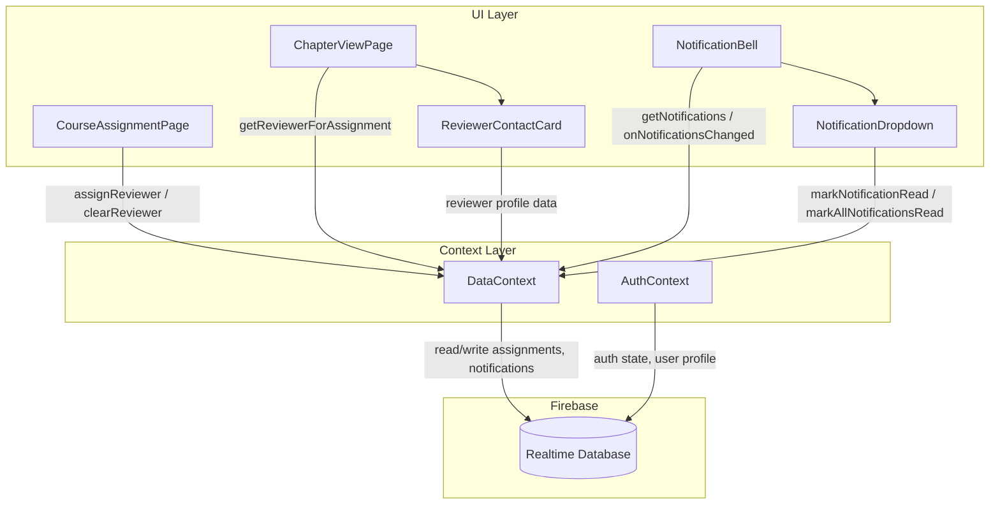

# Design Document: Reviewer System

## Overview

The Reviewer System extends the DeepCortex learning platform with two capabilities: (1) leadership users can assign any existing user as a reviewer for a specific learner-course assignment, and (2) an in-app notification system alerts users about reviewer assignments and learner activity (chapter completions, assessment submissions, exercise submissions).

This feature does not introduce a new role. "Reviewer" is an assignment-level concept — a `reviewerId` field on an existing assignment record. Any user (learner or leadership) can be a reviewer. The notification system is user-scoped, stored in Firebase Realtime Database, and rendered via a bell icon in both layout headers.

### Key Design Decisions

- **No new role**: Reviewer is a field on `assignments/{id}`, not a role on `users/{uid}`. This avoids auth/role complexity and keeps the existing RBAC intact.
- **Notifications in RTDB**: Stored at `notifications/{userId}/{notificationId}` for real-time reads. No Cloud Functions — notifications are created client-side within DataContext operations.
- **Client-side notification creation**: When DataContext functions like `assignReviewer`, `markChapterComplete`, `submitAssessment`, or `submitExercise` execute, they also push notification records. This keeps the architecture simple (no backend triggers) at the cost of requiring the client to have write access to other users' notification paths (handled via security rules for leadership, and direct writes for reviewer notifications during learner activity).
- **No encryption for notifications**: Notification messages contain names and course titles (not assessment answers or exercise text), so encryption is unnecessary.

## Architecture



### Data Flow

1. **Reviewer Assignment**: Leadership selects reviewer in CourseAssignmentPage → `assignReviewer(assignmentId, reviewerUid)` writes `reviewerId` to `assignments/{id}` → creates notifications for learner and reviewer.
2. **Reviewer Contact Card**: Learner opens ChapterViewPage → `getReviewerForAssignment` reads `reviewerId` from assignment → resolves reviewer profile via `getUserById` → renders ReviewerContactCard.
3. **Activity Notifications**: Learner completes chapter / submits assessment / submits exercise → existing DataContext functions are extended to call `createNotification` for the assigned reviewer (if one exists).
4. **Notification Display**: NotificationBell subscribes to `notifications/{userId}` via `onValue` listener → renders unread count badge → dropdown shows sorted notifications.

## Components and Interfaces

### New Components

#### `NotificationBell` (`src/components/NotificationBell.jsx`)
A header component that displays a bell icon with an unread notification count badge.

**Props**: None (reads auth user from `useAuth()`, notifications from `useData()`)

**Behavior**:
- Subscribes to notifications via `useData().subscribeToNotifications(userId, callback)` on mount
- Displays unread count as a badge; hides badge when count is 0
- Toggles NotificationDropdown on click
- Closes dropdown on outside click

#### `NotificationDropdown` (`src/components/NotificationDropdown.jsx`)
A dropdown panel rendered below the NotificationBell showing a list of notifications.

**Props**:
- `notifications`: Array of notification objects
- `onMarkRead(notificationId)`: Callback to mark a single notification as read
- `onMarkAllRead()`: Callback to mark all notifications as read
- `onClose()`: Callback to close the dropdown

**Behavior**:
- Renders notifications sorted by `createdAt` descending
- Shows relative timestamps (e.g., "2 minutes ago")
- Visually distinguishes unread (highlighted background) from read notifications
- "Mark all as read" button in the header

#### `ReviewerContactCard` (`src/components/ReviewerContactCard.jsx`)
A floating card on ChapterViewPage showing the assigned reviewer's contact info.

**Props**:
- `reviewer`: `{ name, email }` object
- `learnerName`: string — the current learner's name

**Behavior**:
- Renders as a fixed-position floating button on the right side of the page
- Expands on click to show reviewer name, email, and message: "Hey [learnerName], let me know if you have any doubts. I'm the reviewer assigned to you."
- Collapses on second click or close button
- Hidden entirely when `reviewer` prop is null/undefined

### Modified Components

#### `CourseAssignmentPage` (`src/pages/leadership/CourseAssignmentPage.jsx`)
- Add a "Reviewer" column to the learner assignment table
- For each assigned learner, render a `<select>` dropdown populated with all users except the learner themselves
- On selection change, call `assignReviewer(assignmentId, reviewerUid)`
- On clearing selection, call `assignReviewer(assignmentId, null)` which removes the `reviewerId`
- Display current reviewer name for assignments that have one

#### `ChapterViewPage` (`src/pages/learner/ChapterViewPage.jsx`)
- After loading the assignment, fetch reviewer profile if `reviewerId` exists
- Render `<ReviewerContactCard>` when a reviewer is assigned
- No changes to existing assessment/exercise/chapter-completion logic (notification creation is handled inside DataContext)

#### `LeadershipLayout` / `LearnerLayout` (`src/layouts/`)
- Add `<NotificationBell />` to the `<header className="top-header">` section, positioned before the `.user-info` div

### New DataContext Functions

```javascript
// Reviewer assignment
assignReviewer(assignmentId, reviewerUid)    // sets or clears reviewerId, creates notifications
getReviewerForAssignment(assignmentId)       // returns reviewer user profile or null

// Notifications
createNotification(userId, { type, message, metadata })  // pushes to notifications/{userId}
subscribeToNotifications(userId, callback)                // onValue listener, returns unsubscribe fn
markNotificationRead(userId, notificationId)              // sets read: true
markAllNotificationsRead(userId)                          // sets read: true for all unread
```

### Modified DataContext Functions

- `markChapterComplete`: After marking complete, look up assignment's `reviewerId` → if exists, call `createNotification` for reviewer with type `chapter_completed`
- `submitAssessment`: After submitting, look up assignment's `reviewerId` → if exists, call `createNotification` for reviewer with type `assessment_submitted`
- `submitExercise`: After submitting, look up assignment's `reviewerId` → if exists, call `createNotification` for reviewer with type `exercise_submitted`
- `deleteAssignment`: Existing function already removes the full assignment record (including `reviewerId`), no change needed

## Data Models

### Assignment Record (extended)

Path: `assignments/{assignmentId}`

```json
{
  "learnerId": "uid-123",
  "courseId": "course-abc",
  "status": "in_progress",
  "targetCompletionDate": null,
  "assignedAt": "2025-01-15T10:00:00.000Z",
  "reviewerId": "uid-456"
}
```

The `reviewerId` field is optional. When absent or null, no reviewer is assigned.

### Notification Record

Path: `notifications/{userId}/{notificationId}`

```json
{
  "type": "reviewer_assigned",
  "message": "You have been assigned as a reviewer for Alice in Introduction to AI",
  "read": false,
  "createdAt": "2025-01-15T10:05:00.000Z",
  "metadata": {
    "assignmentId": "assign-789",
    "courseId": "course-abc",
    "learnerId": "uid-123",
    "reviewerId": "uid-456"
  }
}
```

**Notification Types**:
| Type | Recipient | Trigger |
|------|-----------|---------|
| `reviewer_assigned` | Learner | Reviewer assigned/changed |
| `reviewer_assigned` | Reviewer | Assigned as reviewer |
| `chapter_completed` | Reviewer | Learner completes a chapter |
| `assessment_submitted` | Reviewer | Learner submits assessment |
| `exercise_submitted` | Reviewer | Learner submits exercise |

### Model Factory Function (addition to `src/models/index.js`)

```javascript
/**
 * @typedef {Object} Notification
 * @property {string} id
 * @property {string} type
 * @property {string} message
 * @property {boolean} read
 * @property {string} createdAt
 * @property {Object} metadata
 */
export function createNotification({ type, message, metadata = {} }) {
  return {
    id: generateId(),
    type,
    message,
    read: false,
    createdAt: new Date().toISOString(),
    metadata,
  };
}
```

### Security Rules (additions to `database.rules.json`)

```json
{
  "notifications": {
    "$userId": {
      ".read": "auth != null && auth.uid === $userId",
      ".write": "auth != null && (auth.uid === $userId || root.child('users').child(auth.uid).child('role').val() === 'leadership')"
    }
  }
}
```

The existing `assignments/$assignmentId/.write` rule already allows leadership to write any field (including `reviewerId`). Learners can also write to their own assignments (for progress updates), but the `reviewerId` field is only set by leadership through the CourseAssignmentPage UI.


## Correctness Properties

*A property is a characteristic or behavior that should hold true across all valid executions of a system — essentially, a formal statement about what the system should do. Properties serve as the bridge between human-readable specifications and machine-verifiable correctness guarantees.*

### Property 1: Reviewer assignment round-trip

*For any* assignment and any valid user UID, calling `assignReviewer(assignmentId, uid)` and then reading the assignment's `reviewerId` should return that same UID. Conversely, calling `assignReviewer(assignmentId, null)` and then reading should return null/undefined.

**Validates: Requirements 1.4, 1.5, 3.1**

### Property 2: Self-exclusion from reviewer dropdown

*For any* learner and any set of users, the list of eligible reviewers for that learner's assignment should contain every user except the learner themselves. The length of the eligible list should equal the total user count minus one, and the learner's UID should not appear in the list.

**Validates: Requirements 1.3**

### Property 3: Reviewer assignment creates notifications for both parties

*For any* assignment with a learner and a newly assigned reviewer, calling `assignReviewer` should create exactly two notifications of type `reviewer_assigned` — one for the learner and one for the reviewer — each containing the correct course name and counterpart's name in the message.

**Validates: Requirements 4.1, 4.2, 4.4**

### Property 4: Notification structure invariant

*For any* notification created by `createNotification`, the resulting record should have all required fields: `type` (non-empty string), `message` (non-empty string), `read` (boolean, defaulting to `false`), `createdAt` (valid ISO 8601 timestamp), and `metadata` (object).

**Validates: Requirements 4.3, 5.4**

### Property 5: Activity events create reviewer notifications

*For any* learner activity event (chapter completion, assessment submission, or exercise submission) where the learner's course assignment has a `reviewerId`, a notification of the corresponding type (`chapter_completed`, `assessment_submitted`, or `exercise_submitted`) should be created for the reviewer, and the notification message should contain the learner's name and the course name.

**Validates: Requirements 5.1, 5.2, 5.3**

### Property 6: No notification when no reviewer assigned

*For any* learner activity event (chapter completion, assessment submission, or exercise submission) where the learner's course assignment has no `reviewerId`, no notification should be created.

**Validates: Requirements 5.5**

### Property 7: Unread count equals number of unread notifications

*For any* list of notifications for a user, the displayed badge count should equal the number of notifications where `read === false`. When that count is zero, no badge should be displayed.

**Validates: Requirements 6.2, 6.3, 7.4**

### Property 8: Notifications sorted descending by createdAt

*For any* list of notifications displayed in the dropdown, each notification's `createdAt` timestamp should be greater than or equal to the next notification's `createdAt` timestamp (newest first).

**Validates: Requirements 6.4**

### Property 9: Notification rendering includes message and relative timestamp

*For any* notification object with a `message` and `createdAt` field, the rendered notification item should contain the original message text and a human-readable relative timestamp string.

**Validates: Requirements 6.5**

### Property 10: Mark single notification as read

*For any* unread notification, calling `markNotificationRead(userId, notificationId)` should set that notification's `read` field to `true` while leaving all other notifications unchanged.

**Validates: Requirements 7.1**

### Property 11: Mark all notifications as read

*For any* set of notifications for a user (with a mix of read and unread), calling `markAllNotificationsRead(userId)` should result in every notification having `read === true`.

**Validates: Requirements 7.3**

### Property 12: Notification access restricted to own records

*For any* two distinct users A and B, user A's security rules should allow read/write access to `notifications/A` but deny read/write access to `notifications/B` (unless A has the leadership role, in which case write access to `notifications/B` is allowed).

**Validates: Requirements 8.3**

## Error Handling

| Scenario | Handling |
|----------|----------|
| `assignReviewer` called with invalid assignmentId | Throw error; Firebase will reject the write if the path doesn't exist under security rules. The UI should catch and display an error message. |
| `assignReviewer` called with a reviewerUid that equals the learnerId | The UI prevents this via dropdown filtering (Property 2). If bypassed, the write succeeds but is logically invalid — a defensive check in `assignReviewer` should reject this case. |
| `getUserById` fails when resolving reviewer profile | ReviewerContactCard renders nothing (hidden state). ChapterViewPage catches the error and treats it as "no reviewer assigned." |
| `createNotification` fails (e.g., permission denied) | Log the error but do not block the primary operation (assignment, chapter completion, etc.). Notifications are best-effort. |
| `subscribeToNotifications` connection lost | Firebase RTDB SDK handles reconnection automatically. The `onValue` listener will re-fire when connection is restored. |
| User clicks notification that was already deleted | `markNotificationRead` will write to a non-existent path, creating a partial record. Defensive check: verify notification exists before marking read, or handle gracefully in the UI. |
| Notification dropdown opened with no notifications | Display an empty state message: "No notifications yet." |
| Leadership user tries to assign reviewer before selecting a course | The reviewer column only appears for assigned learners when a course is selected. No action possible. |

## Testing Strategy

### Testing Framework

- **Unit/Integration tests**: Vitest + React Testing Library (already configured)
- **Property-based tests**: fast-check (already installed as `fast-check@^4.6.0`)
- **Test location**: `src/__tests__/unit/` for unit tests, `src/__tests__/unit/` for property tests (co-located)

### Unit Tests

Unit tests cover specific examples, edge cases, and integration points:

- **ReviewerContactCard**: Renders expanded state with correct name, email, message; collapses on click; hidden when no reviewer
- **NotificationBell**: Renders badge with correct count; no badge when 0; toggles dropdown
- **NotificationDropdown**: Renders notifications in order; distinguishes read/unread; "Mark all as read" button present
- **CourseAssignmentPage reviewer column**: Reviewer column visible when course selected; dropdown excludes learner; displays current reviewer name
- **Security rules**: Test with Firebase rules testing SDK for specific allow/deny scenarios (Requirements 8.1–8.5)
- **createNotification model**: Correct default values, field presence

### Property-Based Tests

Each correctness property maps to a single property-based test using fast-check. All property tests run a minimum of 100 iterations.

| Test | Property | Tag |
|------|----------|-----|
| Reviewer assignment round-trip | Property 1 | Feature: reviewer-system, Property 1: Reviewer assignment round-trip |
| Self-exclusion filter | Property 2 | Feature: reviewer-system, Property 2: Self-exclusion from reviewer dropdown |
| Dual notification on assignment | Property 3 | Feature: reviewer-system, Property 3: Reviewer assignment creates notifications for both parties |
| Notification structure | Property 4 | Feature: reviewer-system, Property 4: Notification structure invariant |
| Activity notification creation | Property 5 | Feature: reviewer-system, Property 5: Activity events create reviewer notifications |
| No notification without reviewer | Property 6 | Feature: reviewer-system, Property 6: No notification when no reviewer assigned |
| Unread count accuracy | Property 7 | Feature: reviewer-system, Property 7: Unread count equals number of unread notifications |
| Sort order | Property 8 | Feature: reviewer-system, Property 8: Notifications sorted descending by createdAt |
| Rendered content | Property 9 | Feature: reviewer-system, Property 9: Notification rendering includes message and relative timestamp |
| Mark single read | Property 10 | Feature: reviewer-system, Property 10: Mark single notification as read |
| Mark all read | Property 11 | Feature: reviewer-system, Property 11: Mark all notifications as read |
| Access control | Property 12 | Feature: reviewer-system, Property 12: Notification access restricted to own records |

### Test Configuration

```javascript
// fast-check configuration for all property tests
fc.assert(
  fc.property(/* arbitraries */, (/* generated values */) => {
    // property assertion
  }),
  { numRuns: 100 }
);
```

Each property test file should include a comment referencing the design property:
```javascript
// Feature: reviewer-system, Property N: <property title>
```
