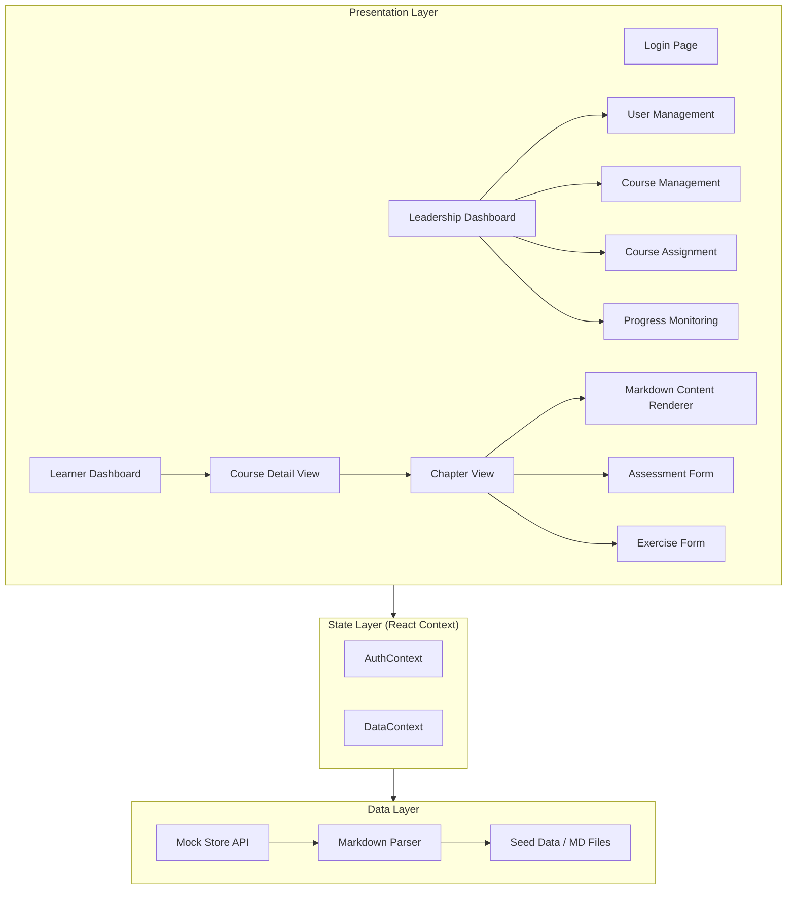
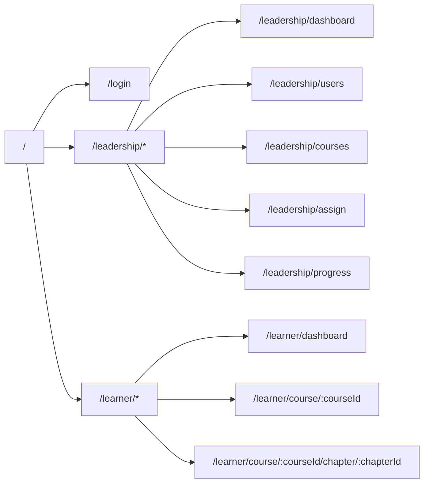

# Design Document — Zeb DeepCortex

## Overview

Zeb DeepCortex is a React single-page application (Vite + React JSX) that provides a dual-role learning platform. Leadership users manage learners, create courses by uploading markdown files, assign courses, and monitor progress. Learners consume assigned courses with enforced sequential chapter progression, take assessments, and submit exercises.

All data lives in an in-memory mock store seeded from actual markdown files in `Courses/Chapters/`. There is no backend — the mock store exposes a promise-based API interface so future backend integration requires minimal refactoring.

Key libraries to add:
- `react-router-dom` — client-side routing and role-based route guards
- `react-markdown` + `remark-gfm` — render parsed markdown content as styled HTML
- `react-syntax-highlighter` — code block syntax highlighting inside rendered markdown
- `fast-check` — property-based testing library (dev dependency)
- `vitest` + `@testing-library/react` — test runner and component testing (dev dependencies)

No additional state management library is needed; React Context + `useReducer` is sufficient for this prototype's scope.

## Architecture

The application follows a layered architecture with clear separation between data, state, and presentation.



### Routing Structure



Role-based route guards (`RequireAuth` and `RequireRole` wrapper components) protect routes. Unauthenticated users redirect to `/login`. Role mismatches redirect to the user's own dashboard.


## Components and Interfaces

### 1. Auth Module

**`AuthContext`** — React context providing authentication state and actions.

```jsx
// AuthContext value shape
{
  user: { id, name, email, role } | null,
  isAuthenticated: boolean,
  login: (email, password) => Promise<{ success, error? }>,
  logout: () => void
}
```

**`RequireAuth`** — Route wrapper that redirects unauthenticated users to `/login`.

**`RequireRole`** — Route wrapper that checks `user.role` and redirects mismatched roles to their own dashboard.

**`LoginPage`** — Form with email/password fields. On submit, calls `login()`. Displays inline error on failure.

### 2. Layout Components

**`LeadershipLayout`** — Sidebar with links: Dashboard, User Management, Course Management, Course Assignment, Progress Monitoring. Header shows user name and role. Logout button.

**`LearnerLayout`** — Sidebar with links: Dashboard (My Courses), Profile. Header shows user name and role. Logout button.

Both layouts render an `<Outlet />` for nested route content.

### 3. Leadership Views

**`UserManagementPage`** — Table of learner accounts (name, email, role, assigned course count). CRUD forms for creating/editing users. Delete with confirmation dialog. Validation on required fields.

**`CourseManagementPage`** — List of courses with title, chapter count, and actions. Upload `.md` files to create/extend courses. Reorder chapters via drag or up/down controls. Delete course with confirmation. Download markdown template button.

**`CourseAssignmentPage`** — Side-by-side lists of courses and learners. Assign/unassign courses. Shows assignment status (not started, in progress, completed). Prevents duplicate assignment with message.

**`ProgressMonitoringPage`** — Summary table: learner name, assigned courses, progress %, timeline status. Drill-down into learner-course pair showing chapter-wise completion, assessment scores, exercise submission status. Filters by course, learner, or status.

### 4. Learner Views

**`LearnerDashboardPage`** — Cards for each assigned course showing title, description, progress %, timeline status, overdue indicator. No catalog or search. Click navigates to course detail.

**`CourseDetailPage`** — Ordered list of chapters. Completed chapters are accessible. First incomplete chapter is accessible. Subsequent chapters are locked (visually disabled). Timeline prompt if no date set.

**`ChapterViewPage`** — Three sections rendered in order:
1. Markdown content body (rendered via `MarkdownRenderer`)
2. Assessment section (interactive multiple-choice forms)
3. Exercise section (text submission forms)

Chapter completion requires all assessments submitted and all exercises submitted.

### 5. Shared Components

**`MarkdownRenderer`** — Wraps `react-markdown` with `remark-gfm` plugin. Custom renderers for:
- Headings → styled `<h1>`–`<h6>` with hierarchy
- Code blocks → `react-syntax-highlighter` with monospace font
- Tables → bordered table with header styling and alternating row shading
- Inline formatting (bold, italic, inline code) → appropriate `<strong>`, `<em>`, `<code>`
- Lists → proper indentation and markers

**`AssessmentCard`** — Renders a single multiple-choice question. Radio buttons for options. Visual selection indicator. Correct/incorrect feedback after submission.

**`ExerciseCard`** — Renders exercise title, instructions, text area input. Submit button enabled when input is non-empty. Shows confirmation, submitted text, and timestamp after submission.

**`TimelinePicker`** — Date input for setting/updating target completion date.

**`OverdueIndicator`** — Visual badge shown when current date exceeds planned completion and course is not completed.

### 6. Markdown Parser

**`parseMarkdownFile(markdownString)`** — Pure function that takes raw markdown text and returns a structured chapter object.

```js
// Input: raw markdown string
// Output:
{
  title: string,           // extracted from top-level heading
  contentBody: string,     // markdown text between title and first special block
  assessments: [
    {
      question: string,
      options: [{ text: string, isCorrect: boolean }],
    }
  ],
  exercises: [
    {
      title: string,
      instructions: string,
      submissionType: string  // e.g. "text"
    }
  ]
}
```

The parser uses a convention-based block format within the markdown files:

```markdown
# Chapter Title

(content body — standard markdown)

## Assessment

### Q1: Question text here?
- [ ] Option A
- [x] Option B (correct)
- [ ] Option C
- [ ] Option D

### Q2: Another question?
- [x] Correct option
- [ ] Wrong option

## Exercise

### Exercise 1: Exercise Title
Instructions for the exercise go here. Describe what the learner should do.
**Submission Type:** text
```

**`validateMarkdownStructure(parsed)`** — Validates parsed output: at least one heading, assessment questions have ≥2 options, each assessment has a correct answer marked.

### 7. Course Template Generator

**`generateCourseTemplate()`** — Returns a string containing the downloadable `.md` template with sample sections and inline comments explaining the format.

### 8. Mock Store API

**`mockStoreApi`** — Module exposing promise-based functions. All functions return `Promise` to mirror a real API.

```js
// Users
getUsers()              → Promise<User[]>
getUserById(id)         → Promise<User>
createUser(data)        → Promise<User>
updateUser(id, data)    → Promise<User>
deleteUser(id)          → Promise<void>

// Courses
getCourses()            → Promise<Course[]>
getCourseById(id)       → Promise<Course>
createCourse(data)      → Promise<Course>
updateCourse(id, data)  → Promise<Course>
deleteCourse(id)        → Promise<void>
addChaptersToCourse(courseId, chapters) → Promise<Course>
reorderChapters(courseId, orderedIds)   → Promise<Course>

// Assignments
getAssignments(filters?)           → Promise<Assignment[]>
createAssignment(learnerId, courseId) → Promise<Assignment>
deleteAssignment(id)               → Promise<void>

// Progress
getProgress(learnerId, courseId)    → Promise<ProgressRecord>
markChapterComplete(learnerId, courseId, chapterId) → Promise<void>
submitAssessment(learnerId, chapterId, answers)     → Promise<AssessmentResult>
submitExercise(learnerId, chapterId, exerciseId, text) → Promise<ExerciseSubmission>

// Timeline
setTimeline(assignmentId, targetDate) → Promise<void>
updateTimeline(assignmentId, targetDate) → Promise<void>

// Auth
authenticate(email, password) → Promise<{ user } | { error }>
```


## Data Models

### User

```js
{
  id: string,           // UUID
  name: string,
  email: string,
  password: string,     // plain text for mock (no real auth)
  role: "leadership" | "learner"
}
```

### Course

```js
{
  id: string,
  title: string,
  description: string,
  chapters: Chapter[],  // ordered array
  createdAt: string     // ISO date
}
```

### Chapter

```js
{
  id: string,
  courseId: string,
  sequenceOrder: number,       // 1-based
  title: string,
  contentBody: string,         // raw markdown for rendering
  assessments: Assessment[],
  exercises: Exercise[]
}
```

### Assessment

```js
{
  id: string,
  chapterId: string,
  question: string,
  options: [
    { id: string, text: string, isCorrect: boolean }
  ]
}
```

### Exercise

```js
{
  id: string,
  chapterId: string,
  title: string,
  instructions: string,
  submissionType: "text"
}
```

### Assignment

```js
{
  id: string,
  learnerId: string,
  courseId: string,
  status: "not_started" | "in_progress" | "completed",
  targetCompletionDate: string | null,  // ISO date
  assignedAt: string                    // ISO date
}
```

### ProgressRecord

```js
{
  learnerId: string,
  courseId: string,
  completedChapterIds: string[],
  assessmentResults: {
    [chapterId]: {
      answers: { [assessmentId]: string },  // selected option id
      score: number,
      total: number,
      submittedAt: string
    }
  },
  exerciseSubmissions: {
    [exerciseId]: {
      text: string,
      submittedAt: string
    }
  }
}
```

### Seed Data Strategy

On app initialization:
1. The markdown parser reads the 3 existing chapter files from `Courses/Chapters/` (imported as raw strings via Vite's `?raw` import).
2. Since the existing chapters don't contain assessment/exercise blocks, the seed data module programmatically generates 3 assessment questions per chapter and 1 exercise for chapters 1 and 3, injecting them into the parsed chapter objects.
3. A seed course "Neural Machine Translation" is created with these 3 chapters in sequence order.
4. 3 Leadership users and 10 Learner accounts are created with hardcoded data.
5. Assignments are created with varied statuses: some not started, some in progress (with partial chapter completion), some completed.
6. The mock store is initialized with this seed data and all subsequent operations mutate the in-memory state.


## Correctness Properties

*A property is a characteristic or behavior that should hold true across all valid executions of a system — essentially, a formal statement about what the system should do. Properties serve as the bridge between human-readable specifications and machine-verifiable correctness guarantees.*

### Property 1: Valid credentials authenticate and store session

*For any* user in the mock store with valid credentials, calling `authenticate(email, password)` should return a user object, and the auth context should contain that user with `isAuthenticated === true`.

**Validates: Requirements 1.1**

### Property 2: Role-based routing after login

*For any* user who successfully logs in, the router should navigate to `/leadership/dashboard` if the user's role is "leadership", or `/learner/dashboard` if the user's role is "learner".

**Validates: Requirements 1.2, 1.3**

### Property 3: Invalid credentials produce error

*For any* email/password combination that does not match a user in the mock store, calling `authenticate(email, password)` should return an error object and `isAuthenticated` should remain `false`.

**Validates: Requirements 1.4**

### Property 4: Unauthenticated access redirects to login

*For any* protected route path, when no user is authenticated, navigating to that path should redirect to `/login`.

**Validates: Requirements 1.5**

### Property 5: Role mismatch redirects to own dashboard

*For any* authenticated user attempting to access a route belonging to the other role, the router should redirect to the user's own role-appropriate dashboard.

**Validates: Requirements 1.6, 1.7**

### Property 6: User CRUD round trip

*For any* valid user data (name, email, role), creating a user via `createUser(data)` then retrieving via `getUserById(id)` should return a user matching the original data. Updating that user with new valid data via `updateUser(id, newData)` then retrieving should return the updated data.

**Validates: Requirements 2.2, 2.3**

### Property 7: User deletion removes from store

*For any* existing user, calling `deleteUser(id)` should result in `getUserById(id)` rejecting or returning null, and the user should no longer appear in `getUsers()`.

**Validates: Requirements 2.4**

### Property 8: User form validation rejects missing required fields

*For any* user form submission where one or more required fields (name, email, role) are empty or missing, the platform should display a validation error for each invalid field and not create/update the user record.

**Validates: Requirements 2.5**

### Property 9: Markdown parser extracts title and content body

*For any* valid markdown string with a top-level heading followed by standard markdown content, `parseMarkdownFile(md)` should return an object where `title` equals the top-level heading text and `contentBody` contains the markdown text between the title and the first special block.

**Validates: Requirements 4.1, 4.2**

### Property 10: Markdown parser extracts assessments and exercises

*For any* valid markdown string containing assessment blocks (with questions, options, correct answer indicators) and exercise blocks (with title, instructions, submission type), `parseMarkdownFile(md)` should return assessments with the correct question count, option count, and correct answer flags, and exercises with the correct title and instructions.

**Validates: Requirements 4.3, 4.4**

### Property 11: Markdown parser round trip for template

*For any* markdown string generated by `generateCourseTemplate()`, parsing it with `parseMarkdownFile()` should produce a valid chapter object with a non-empty title, at least one assessment with ≥2 options and a correct answer, and at least one exercise.

**Validates: Requirements 3.2, 14.2, 14.3, 14.4, 14.5**

### Property 12: Invalid upload rejection

*For any* file with an extension other than `.md`, or any markdown string that does not conform to the expected template structure (missing heading, assessment with <2 options, assessment without correct answer), the parser/validator should return a descriptive error.

**Validates: Requirements 3.8, 3.9, 4.8, 4.9**

### Property 13: Course chapter sequencing from file names

*For any* set of markdown files with names following the pattern `chapter-NN-*.md`, creating a course from those files should produce chapters in ascending order of the numeric prefix.

**Validates: Requirements 3.3**

### Property 14: Appending chapters preserves and extends sequence

*For any* existing course with N chapters and any set of new markdown files, appending them should result in a course with N + (new file count) chapters, where the original chapters retain their sequence positions and new chapters follow in order.

**Validates: Requirements 3.4**

### Property 15: Chapter reordering updates sequence

*For any* course and any permutation of its chapter IDs, calling `reorderChapters(courseId, permutedIds)` should result in chapters ordered according to the permutation.

**Validates: Requirements 3.5**

### Property 16: Course deletion removes course and chapters

*For any* existing course, calling `deleteCourse(id)` should result in `getCourseById(id)` rejecting or returning null.

**Validates: Requirements 3.6**

### Property 17: Assignment creation with initial status

*For any* learner and any course not already assigned to that learner, calling `createAssignment(learnerId, courseId)` should produce an assignment with status "not_started".

**Validates: Requirements 5.2**

### Property 18: Duplicate assignment prevention

*For any* learner-course pair that already has an assignment, calling `createAssignment(learnerId, courseId)` again should be rejected with an appropriate error.

**Validates: Requirements 5.4**

### Property 19: Assignment deletion removes record

*For any* existing assignment, calling `deleteAssignment(id)` should result in the assignment no longer appearing in `getAssignments()`.

**Validates: Requirements 5.3**

### Property 20: Learner dashboard shows only assigned courses

*For any* learner, the dashboard should display exactly the courses assigned to that learner — no more, no fewer.

**Validates: Requirements 6.1**

### Property 21: Sequential chapter access control

*For any* course and any progress state (set of completed chapter IDs), only chapters that are completed or the first incomplete chapter in sequence should be accessible. All subsequent chapters should be locked.

**Validates: Requirements 7.2, 7.3**

### Property 22: Chapter completion unlocks next

*For any* chapter where all assessments are submitted and all exercises are submitted, calling `markChapterComplete` should mark it as completed. If a next chapter exists in sequence, it should become accessible.

**Validates: Requirements 7.4**

### Property 23: Course completion when all chapters done

*For any* course where all chapters are marked as completed, the course assignment status should be "completed".

**Validates: Requirements 7.5**

### Property 24: Assessment evaluation correctness

*For any* set of assessment answers for a chapter, submitting them should produce a result where each answer is marked correct if and only if it matches the correct option, and the score equals the count of correct answers out of total questions.

**Validates: Requirements 8.3, 8.4**

### Property 25: Exercise submission round trip

*For any* exercise and any non-empty submission text, calling `submitExercise(learnerId, chapterId, exerciseId, text)` then reading the exercise submission should return the same text and a valid timestamp.

**Validates: Requirements 9.3, 9.4**

### Property 26: Empty exercise submission rejected

*For any* string composed entirely of whitespace (including empty string), attempting to submit it as an exercise should be rejected with a validation error, and no submission record should be created.

**Validates: Requirements 9.5**

### Property 27: Timeline persistence round trip

*For any* assignment and any valid future date, calling `setTimeline(assignmentId, date)` then reading the assignment should return the same target completion date. Calling `updateTimeline(assignmentId, newDate)` then reading should return the new date.

**Validates: Requirements 10.2, 10.5**

### Property 28: Overdue detection

*For any* assignment where the current date exceeds the target completion date and the course status is not "completed", the assignment should be flagged as overdue / "behind schedule".

**Validates: Requirements 10.4, 11.4**

### Property 29: Progress filtering

*For any* filter combination (by course, by learner, or by status), the filtered results from the progress monitoring view should contain only records matching all applied filter criteria.

**Validates: Requirements 11.5**

### Property 30: Markdown rendering produces correct HTML elements

*For any* markdown string containing headings, code blocks, tables, inline formatting (bold, italic, inline code), and lists, the rendered HTML output should contain the corresponding HTML elements: `<h1>`–`<h6>` for headings, `<pre><code>` for code blocks, `<table>` with `<th>`/`<td>` for tables, `<strong>`/`<em>`/`<code>` for inline formatting, and `<ol>`/`<ul>`/`<li>` for lists.

**Validates: Requirements 15.1, 15.2, 15.3, 15.4, 15.5**

### Property 31: Mock store functions return promises

*For any* function exposed by the mock store API, calling it should return a value that is an instance of `Promise`.

**Validates: Requirements 13.7**

### Property 32: Mock store in-memory persistence

*For any* data mutation (create, update, delete) performed on the mock store, subsequent reads within the same session should reflect the mutation.

**Validates: Requirements 13.6**


## Error Handling

### Authentication Errors
- Invalid credentials: `authenticate()` resolves with `{ error: "Invalid email or password" }`. The LoginPage displays this inline below the form.
- Session expired / missing: Route guards detect `isAuthenticated === false` and redirect to `/login`.

### Form Validation Errors
- User management forms: Client-side validation checks required fields (name, email, role) before calling the store. Errors displayed inline next to each invalid field.
- Assessment submission: If not all questions are answered, a message is shown and submission is blocked.
- Exercise submission: If text is empty or whitespace-only, a validation error is shown and submission is blocked.

### File Upload Errors
- Non-`.md` file: Rejected at the file input level (accept attribute) and validated programmatically. Error message: "Only .md files are accepted."
- Malformed markdown: The parser returns a structured error object identifying the issue (e.g., "Missing top-level heading", "Assessment Q2 has fewer than 2 options", "Assessment Q3 has no correct answer marked"). Displayed in a dismissible error banner on the upload form.

### Mock Store Errors
- All store functions return promises. Errors are communicated via rejected promises with descriptive error messages.
- Not found: `getUserById`, `getCourseById` with invalid IDs reject with `{ error: "Not found" }`.
- Duplicate assignment: `createAssignment` for an existing pair rejects with `{ error: "Course already assigned to this learner" }`.
- Components use try/catch or `.catch()` to handle rejected promises and display user-friendly error messages.

### Navigation Errors
- Unknown routes: A catch-all route renders a "Page not found" view with a link back to the user's dashboard.
- Role mismatch: Handled by `RequireRole` — redirects silently to the correct dashboard.

## Testing Strategy

### Test Runner and Libraries

- **Test runner**: Vitest (integrates natively with Vite)
- **Component testing**: `@testing-library/react` + `@testing-library/jest-dom`
- **Property-based testing**: `fast-check` (JavaScript PBT library)
- **Configuration**: Each property test runs a minimum of 100 iterations

### Unit Tests (Example-Based)

Unit tests cover specific examples, edge cases, and integration points:

- **Auth module**: Login with known valid credentials, login with wrong password, logout clears state
- **Seed data**: Verify 3 leadership users, 10 learners, 1 course with 3 chapters, varied assignment statuses
- **Course template**: Template contains heading, content body, assessment block, exercise block, and annotations
- **UI access control**: User management view renders for leadership, not for learner; progress monitoring accessible only to leadership
- **Navigation layout**: Leadership sidebar has 5 links; learner sidebar has 2 links
- **Assignment status display**: Status badges render correctly for each status value
- **Template download**: Clicking download triggers file save

### Property-Based Tests

Each property test maps to a correctness property from the design document. Tests use `fast-check` arbitraries to generate random inputs.

Key generator strategies:
- **User generator**: Random name, email, role from `["leadership", "learner"]`
- **Markdown generator**: Random heading + paragraphs + optional assessment blocks (with random questions/options/correct markers) + optional exercise blocks
- **Assignment generator**: Random learner ID, course ID, status, optional target date
- **Answer set generator**: For a given set of assessments, random selection of option IDs per question
- **Date generator**: Random ISO date strings within a reasonable range

Each test is tagged with a comment referencing the design property:
```js
// Feature: zeb-deepcortex, Property 9: Markdown parser extracts title and content body
test.prop([markdownArbitrary], (md) => { ... }, { numRuns: 100 });
```

### Test Organization

```
src/
  __tests__/
    unit/
      auth.test.js
      mockStore.test.js
      markdownParser.test.js
      seedData.test.js
      courseTemplate.test.js
    property/
      auth.property.test.js
      mockStore.property.test.js
      markdownParser.property.test.js
      progression.property.test.js
      assessment.property.test.js
      rendering.property.test.js
    components/
      LoginPage.test.jsx
      UserManagement.test.jsx
      CourseManagement.test.jsx
      LearnerDashboard.test.jsx
      ChapterView.test.jsx
```

### Coverage Goals

- All 32 correctness properties covered by property-based tests
- Unit tests for seed data verification, template content, and key UI interactions
- Component tests for critical user flows (login, course upload, assessment submission, exercise submission)
